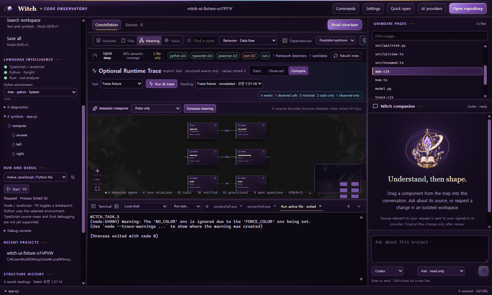
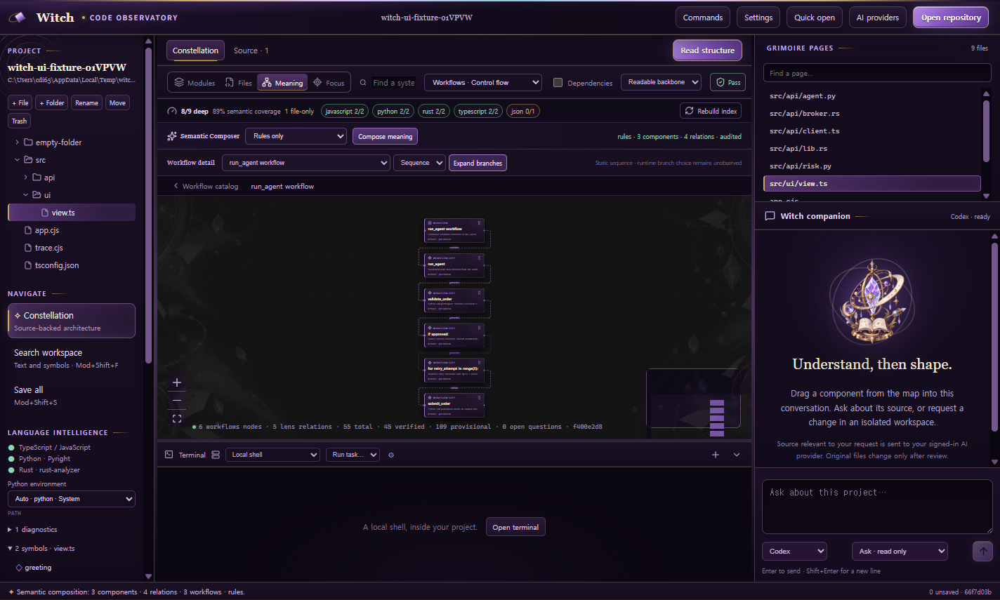
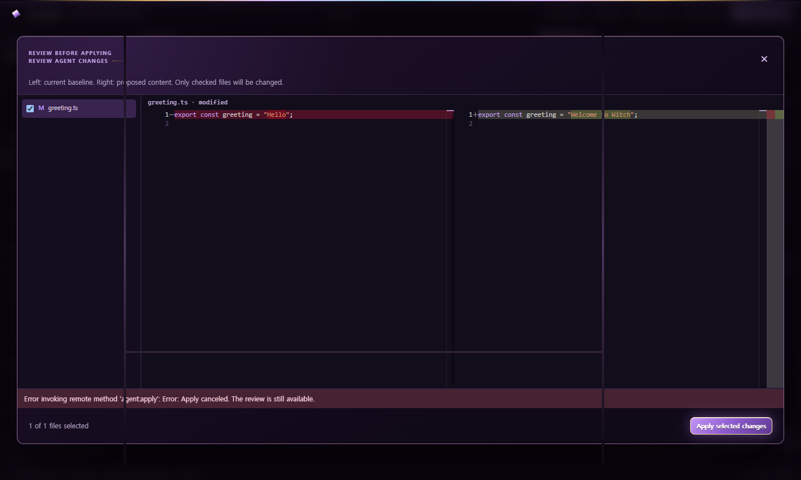
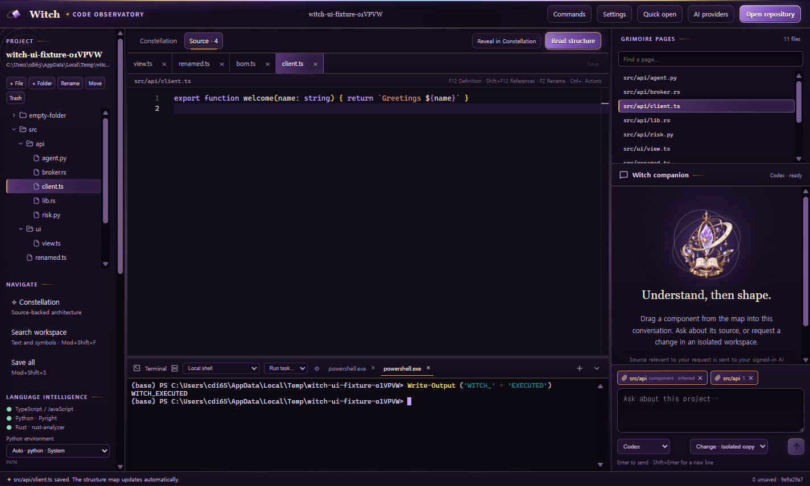

# Witch Desktop

<!-- witch-doc-languages: ko,en -->

[한국어](#한국어) · [English](#english)

<a id="한국어"></a>

## 한국어

Witch는 코드를 파일 목록으로만 읽지 않고 **구조, 의미, Workflow, Behavior, 실제 관측 결과**로 탐색하면서 AI Agent 작업까지 이어가는 로컬 우선 Desktop ADE입니다.

현재 버전은 실제 프로젝트를 열어 편집·검색·실행·디버그할 수 있는 preview입니다. VS Code 전체 호환 제품은 아니며, Git UI와 원격 파일 Workspace 등은 아직 지원하지 않습니다.



## 실제로 할 수 있는 일

### 1. 저장소를 열고 구조부터 읽기

1. **Open repository**에서 로컬 프로젝트를 선택합니다.
2. Witch가 파일을 실행하지 않고 정적으로 인덱싱합니다.
3. **Constellation**에서 Modules, Files, Meaning, Focus 관점을 전환합니다.
4. 노드나 연결을 선택하면 해당 판단의 파일·행·코드 근거를 확인할 수 있습니다.

편집 중인 파일에서 **Reveal in Constellation**을 누르면 해당 파일과 직접 연결된 import/imported-by 관계만 남깁니다. 과거 분석 결과는 **Before · Delta · After**로 비교할 수 있으며, 변경된 노드와 관계만 보여주고 영향도를 임의로 추정하지 않습니다.

분석 결과는 다음 계약으로 서로 분리됩니다.

| Reading | 실제 용도 |
| --- | --- |
| `witch.architecture/v1` | 파일·모듈·import 구조 |
| `witch.semantic/v1` | System·Component·Workflow·Symbol 의미 계층 |
| `witch.behavior/v1` | 호출 인자 전달·반환·상태 접근·side effect 후보 |
| `witch.framework/v1` | 명시적인 route·task·graph·spawn registration |
| `witch.runtime-trace/v1` | 승인된 한 번의 Task 실행에서 관측한 구조 이벤트 |

모든 Reading은 source revision, endpoint, evidence, provenance와 validation receipt를 유지합니다. `Verified`, `Inferred`, `Authored`, `Observed`는 합쳐서 하나의 사실처럼 저장하지 않습니다.

### 2. 큰 Workflow를 요약부터 세부 순서까지 보기

**Meaning → Workflows**는 먼저 Workflow catalog를 보여줍니다. 하나를 열면 Graph 또는 위에서 아래로 흐르는 Sequence로 전환하고, branch-only 경로를 접거나 펼칠 수 있습니다.



현재 깊은 분석 대상은 TypeScript/JavaScript, Python, Rust입니다.

- TypeScript/JavaScript: TypeChecker로 확인한 direct identifier call과 타입 관계
- Python: 함수·클래스·async·decorator·import와 보수적인 내부 호출
- Rust: struct·enum·trait·impl·함수·mod/use와 보수적인 내부 호출
- Pyright 및 설치된 `rust-analyzer`: 진단·정의·참조·Outline·call hierarchy 보강

Workflow는 호출 위치와 명시적 문법을 사용해 `precedes`, `branches-to`, `retries`를 만듭니다. 정적 후보는 실제 실행 순서라고 주장하지 않고 provisional 상태로 남습니다.

### 3. Framework registration과 데이터 흐름 확인하기

**Meaning → Frameworks**는 현재 다음 source-only adapter를 사용합니다.

- Python: FastAPI, LangGraph, Celery
- TypeScript/JavaScript: Express, NestJS, Next.js
- Rust: Axum, Tokio

동적 path, lambda/property handler, 해석할 수 없는 endpoint는 관계로 조용히 승격하지 않고 exclusion diagnostic으로 남깁니다.

**Meaning → Behavior**에서는 direct call의 parameter binding, return, module state access와 framework relation을 탐색합니다. object field, 메시지·DB lineage, dynamic dispatch 전체를 해결한다고 주장하지 않습니다.

### 4. 정적 분석과 실제 실행을 비교하기

Runtime Trace는 기본적으로 꺼져 있습니다.

1. `.witch/tasks.json` 또는 지원되는 `.vscode/tasks.json`에 Task를 준비합니다.
2. **Meaning → Behavior → Optional Runtime Trace**에서 Task를 선택합니다.
3. 표시된 실제 명령과 작업 폴더를 확인하고 **Run & trace**를 승인합니다.
4. **Static / Observed / Compare**로 정적 관계와 관측 관계를 비교합니다.

프로젝트의 test harness나 instrumentation은 다음과 같은 한 줄 marker를 출력할 수 있습니다.

```text
WITCH_TRACE_V1 {"phase":"enter","path":"src/worker.ts","symbol":"run"}
WITCH_TRACE_V1 {"phase":"exit","path":"src/worker.ts","symbol":"run","outcome":"ok"}
```

Witch는 symbol ID, 부모 호출, 순서, duration, outcome만 저장합니다. 인자·반환값·환경값·일반 터미널 출력은 저장하지 않으며, 허용되지 않은 필드가 포함된 marker는 전체를 폐기합니다. 현재 source/semantic revision과 다른 오래된 Trace는 보존하되 그래프에 겹치지 않습니다.

자동 instrumentation, Debug launch trace, cross-process causal trace는 아직 없습니다.

### 5. 그래프에서 AI Agent 작업으로 이어가기

Meaning 카드의 **Add to Agent context**를 누르거나 카드 손잡이를 오른쪽 대화에 끌어놓습니다. Renderer가 보낸 label이나 path를 그대로 신뢰하지 않고, Main process가 현재 검증된 그래프에서 컨텍스트를 다시 해석합니다.

- **Ask**: 프로젝트를 변경하지 않는 질문
- **Change · isolated copy**: 별도 Workspace 복사본에서 변경

Change 실행은 다음 흐름을 거칩니다.

```text
Context → Plan → Isolated execution → Verification → Bounded repair
        → Checkpoint → Diff review → Selected apply → Re-analysis
```

AI의 “완료했습니다” 문장은 완료 근거가 아닙니다. Witch는 실제 변경 파일, immutable baseline, syntax/architecture verification receipt, checkpoint와 diff를 사용합니다. 실패 수리는 최대 2회이며 동일한 실패 fingerprint가 반복되면 중단합니다.



검토 화면에서 적용할 파일만 선택할 수 있습니다. 원본이 외부에서 바뀌었으면 apply를 거부합니다. 미적용 review는 보관하고 다시 복원하거나 현재 baseline에서 child run으로 이어갈 수 있습니다.

### 6. 일반 ADE 작업하기



- 파일·폴더 생성, 이름 변경, 이동, 휴지통 삭제
- Monaco 다중 탭, 저장·모두 저장, UTF-8/BOM/CRLF 보존
- 프로젝트 검색, 빠른 파일 열기, Outline
- 자동완성, hover, signature help, 진단, 정의·참조, review-only rename/code action
- Node.js와 Python/debugpy 디버깅
- 최대 8개 PTY, 여러 탭, Project Task 실행
- 프로젝트별 Python 환경 선택과 uv/Poetry/Ruff/Cargo Task 탐지
- 설정, 단축키, 3개 Witch 테마, 실행 코드 없는 snippet extension
- 파일 감시, 외부 변경 자동 반영, 미저장 충돌 diff
- 시스템 OpenSSH를 통한 대화형 원격 터미널

SSH는 현재 터미널만 원격입니다. Explorer, Editor, Search, LSP, Task, Debugger와 Agent는 열린 로컬 Workspace를 사용합니다.

## AI Provider 연결

**AI providers**에서 로컬 CLI 설치·로그인 상태 또는 API key 설정 상태를 확인합니다.

| Provider | 현재 사용 위치 |
| --- | --- |
| 로그인된 Codex CLI | Ask, 격리 Change, Semantic Composer |
| 로그인된 Claude Code CLI | Ask, 격리 Change, Semantic Composer |
| OpenAI API key | Semantic Composer |
| Anthropic API key | Semantic Composer |
| Rules only | AI 호출 없는 결정적 Semantic Composer |

저장된 API key는 Electron `safeStorage`로 암호화되며 Renderer에서 다시 읽을 수 없습니다. 로컬 구조 분석, 편집, 검색은 AI 요청이 아닙니다. Agent나 AI Composer를 실행하면 선택된 bounded source context가 해당 Provider로 전달될 수 있습니다.

Codex와 Claude의 현재 adapter는 native resume/fork capability를 노출하지 않습니다. Provider가 지원한다고 확인되지 않은 control은 UI에 표시하지 않습니다.

## 시작하기

Node.js 22 이상과 npm이 필요합니다.

```sh
npm ci
npm run dev
```

처음에는 [작은 체험 프로젝트](examples/playground/README.md)를 열면 별도 의존성 설치 없이 구조 분석, 카드 첨부와 검토 흐름을 확인할 수 있습니다.

운영 번들을 만들려면:

```sh
npm run build
```

Windows와 macOS 패키지 정의가 분리되어 있습니다.

```sh
npm run package:win
# macOS 13+ 호스트에서 universal DMG + ZIP
npm run package:mac
```

macOS preview는 ad-hoc 서명이며 Apple Developer ID 서명·공증을 완료한 정식 배포본이 아닙니다.

## 자주 사용하는 단축키

`Mod`는 Windows의 Ctrl, macOS의 Cmd입니다. Settings에서 앱 단축키를 바꿀 수 있습니다.

- `Mod+P`: 빠른 파일 열기
- `Mod+Shift+F`: 프로젝트 검색
- `Mod+S` / `Mod+Shift+S`: 저장 / 모두 저장
- `Mod+Shift+P`: 명령 팔레트
- `F2` / `F12` / `Shift+F12`: 이름 변경 / 정의 / 참조
- `Mod+.`: 코드 액션
- `Mod+K`, `Mod+I`: hover
- `Mod+Shift+Space`: signature help
- `F9` / `F5` / `Shift+F5`: breakpoint / debug / stop

## Project 설정

Witch는 지원 범위 안에서 `.witch/tasks.json`, `.witch/launch.json`, `.vscode/tasks.json`, `.vscode/launch.json`을 읽습니다. 프로젝트를 열었다는 이유만으로 Task, build, test, migration 또는 shell 초기화 스크립트를 실행하지 않습니다.

Rust LSP는 시스템 `rust-analyzer` 또는 절대 경로 `WITCH_RUST_ANALYZER_PATH`를 사용합니다. Rust build script와 proc macro는 자동으로 활성화하지 않습니다. Python debugging은 선택한 환경에 `debugpy`가 이미 설치되어 있어야 하며 자동 설치하지 않습니다.

## Evaluation과 검증

Witch는 외부 벤치마크 코드를 저장소에 복사하지 않고, 어떤 데이터·버전·지표·실행 경계로 성능을 측정했는지를 공개합니다. 세부 기준은 [Evaluation 문서](docs/evaluation/README.md), [재현 절차](docs/evaluation/reproducibility.md), [한계](docs/evaluation/limitations.md)에서 확인할 수 있습니다.

2026-09-02 source checkpoint의 핵심 결과입니다. Call graph의 micro·macro 및 development·holdout 결과는 서로 합산하지 않습니다.

| 검증 축                   |                        결과 | 해석 경계                                                         |
| ------------------------- | --------------------------: | ----------------------------------------------------------------- |
| 단위·통합 테스트          |                  140 passed | 실제 filesystem·LSP·debugger·PTY와 로컬 Provider test double 포함 |
| Electron E2E              |                   25 passed | 임시 Workspace·profile에서 실제 UI와 IPC 실행                     |
| SWARM-CG Python           |            Scoped F1 87.64% | development micro; oracle edge coverage 17.99%                    |
| PyAnalyzer macro C        |            Scoped F1 58.20% | holdout macro; oracle edge coverage 31.68%                        |
| Witch Rust v1             |                   F1 93.75% | development micro; 별도 Rust macro holdout은 아직 없음            |
| DyPyBench 5-project pilot | Dynamic agreement F1 62.73% | upstream test에서 관측된 호출과의 합의이며 정적 정답 전체가 아님  |

상세 수치와 프로젝트별 결과는 [Call-graph result](docs/evaluation/results/callgraph-2026-09-02.md), 제품 검증 범위는 [Product-quality result](docs/evaluation/results/product-quality-2026-09-02.md)에 고정되어 있습니다.

기본 테스트는 외부 AI를 호출하거나 대상 프로젝트 코드를 실행하지 않습니다.

```sh
npm run typecheck
npm test
npm run build
npm run test:e2e
```

E2E는 임시 프로젝트·프로필에서 실제 Editor, LSP, PTY, Debugger, 분석, 격리 diff와 Runtime Trace UI를 실행합니다. Provider protocol만 로컬 test double을 사용합니다. 소스 테스트 통과가 현재 commit의 Windows/macOS package 생성·서명·공증을 뜻하지는 않습니다.

동일 fixture에서 Provider 결과를 비교하는 offline evaluation:

```sh
npm run eval:offline
```

Fake Provider 결과는 결정적이며, replay는 Provider나 command를 다시 실행하지 않습니다. Live evaluation은 코드의 `allowLive`, 명시 승인, `WITCH_LIVE_EVAL=1`을 모두 요구하며 기본 CI에서 실행하지 않습니다.

분석 benchmark:

```sh
npm run benchmark:repository
npm run benchmark:behavior
npm run benchmark:frameworks
npm run benchmark:callgraph:rust
```

외부 call-graph 평가는 `benchmarks/callgraph`의 manifest와 `scripts/benchmark-callgraph.ts`를 사용합니다. 저장소에는 외부 소스·동적 trace·로컬 절대 경로·blind-holdout 상세 실패를 커밋하지 않습니다.

## 중요한 안전 경계

- Terminal, Task, Debugger, SSH는 사용자 권한으로 실행되며 Agent sandbox가 아닙니다.
- Agent Workspace copy는 원본 분리와 review를 위한 것이며 VM/container 보안 경계가 아닙니다.
- Git worktree와 Git stage/commit/branch UI는 아직 구현하지 않았습니다.
- CUA는 현재 선택적인 bounded observation만 연결되어 있고 Agent 클릭·타이핑은 허용하지 않습니다.
- TypeScript source map, Rust debugger, VSIX extension host, Remote file Workspace는 아직 없습니다.
- `.env`, 알려진 credential/private-key 경로는 Agent 복사본에서 제외하지만 소스에 섞인 모든 secret을 탐지한다고 보장하지 않습니다.
- 앱 데이터에는 분석 Reading, Agent journal, checkpoint, review와 Runtime Trace가 남습니다. 자동 삭제하지 않습니다.

세부 구현 범위와 비지원 사항은 [구현 현황](docs/implementation-status.md), [Engineering Core 명세](docs/engineering-core-spec-v0.md), [Runtime Trace·Evaluation](docs/evaluation-runtime-trace.md)을 참고하세요. 문서의 한·영 병기 원칙은 [문서 언어 정책](docs/documentation-policy.md)에 고정되어 있습니다.

## 프로젝트 상태

Witch는 현재 개발 preview입니다. 소스에서 실행하고 테스트할 수 있지만, VS Code 호환성이나 상용 배포 안정성을 주장하지 않습니다. 특히 대형 monorepo, dynamic dispatch 중심 프로젝트, unsupported framework와 원격 Workspace는 제한을 먼저 확인해야 합니다.

<a id="english"></a>

## English

Witch is a local-first desktop ADE for exploring code as **structure, meaning, workflows, behavior, and observed execution**, then carrying that evidence into AI Agent work.

The current release is a development preview that can open real projects for editing, search, execution, and debugging. It is not a full VS Code-compatible product. Git UI and remote file workspaces are not implemented yet.


### What you can do

#### 1. Open a repository and read its structure

1. Select a local project with **Open repository**.
2. Witch indexes it statically without executing project code.
3. Switch among Modules, Files, Meaning, and Focus in **Constellation**.
4. Select a node or relation to inspect its file, line, source evidence, provenance, and validation state.

**Reveal in Constellation** keeps the active file and its direct import/imported-by neighborhood. Historical readings can be compared as **Before · Delta · After**. Witch reports exact structural differences and does not silently reinterpret them as runtime impact.

The analysis contracts remain separate:

| Reading | Purpose |
| --- | --- |
| `witch.architecture/v1` | File, module, import, and export structure |
| `witch.semantic/v1` | System, Component, Workflow, WorkflowStep, File, and Symbol meaning |
| `witch.behavior/v1` | Direct argument, return, state-access, and side-effect candidates |
| `witch.framework/v1` | Explicit route, task, graph, and spawn registrations |
| `witch.runtime-trace/v1` | Structural events observed during one approved Task run |

Every reading retains a source revision, endpoints, evidence, provenance, and a validation receipt. `Verified`, `Inferred`, `Authored`, and `Observed` are never collapsed into one indistinguishable fact.

#### 2. Explore large workflows summary-first

**Meaning → Workflows** opens with a workflow catalog. After selecting one workflow, switch between a graph and a top-to-bottom sequence, then collapse or expand branch-only paths.


Deep analysis currently targets TypeScript/JavaScript, Python, and Rust:

- TypeScript/JavaScript: TypeChecker-backed direct identifier calls and type relations
- Python: functions, classes, async code, decorators, imports, and conservative internal calls
- Rust: structs, enums, traits, implementations, functions, modules, imports, and conservative internal calls
- Pyright and an installed `rust-analyzer`: diagnostics, navigation, Outline, and call-hierarchy corroboration

Workflow relations use call sites and explicit syntax to produce `precedes`, `branches-to`, and `retries`. Static candidates remain provisional and are not presented as proven runtime order.

#### 3. Inspect framework registrations and behavior

**Meaning → Frameworks** currently uses source-only adapters for:

- Python: FastAPI, LangGraph, Celery
- TypeScript/JavaScript: Express, NestJS, Next.js
- Rust: Axum, Tokio

Dynamic paths, unresolved endpoints, and lambda or property handlers are preserved as exclusion diagnostics instead of being promoted silently.

**Meaning → Behavior** shows direct parameter binding, returns, module-state access, and framework relations. Witch does not claim complete object-field, message, database-lineage, or dynamic-dispatch recovery.

#### 4. Compare static analysis with an approved run

Runtime Trace is off by default.

1. Define a Task in `.witch/tasks.json` or a supported `.vscode/tasks.json`.
2. Open **Meaning → Behavior → Optional Runtime Trace**.
3. Review the exact command and working directory, then approve **Run & trace**.
4. Compare **Static / Observed / Compare** readings.

A project test harness may emit one-line structural markers:

```text
WITCH_TRACE_V1 {"phase":"enter","path":"src/worker.ts","symbol":"run"}
WITCH_TRACE_V1 {"phase":"exit","path":"src/worker.ts","symbol":"run","outcome":"ok"}
```

Witch stores symbol identity, parent call, order, duration, and outcome only. It does not store arguments, return values, environment values, or ordinary terminal output. Markers containing forbidden value fields are discarded entirely. Stale traces are retained but not overlaid on a different source or Semantic revision.

Automatic instrumentation, Debug-launch tracing, and cross-process causal tracing are not implemented yet.

#### 5. Continue from a graph into AI Agent work

Use **Add to Agent context** on a Meaning card, or drag the card into the conversation panel. The main process resolves the selection again from the current validated graph instead of trusting renderer-provided labels or paths.

- **Ask**: answer without modifying the project
- **Change · isolated copy**: propose edits in a separate workspace copy

Change runs follow this flow:

```text
Context → Plan → Isolated execution → Verification → Bounded repair
        → Checkpoint → Diff review → Selected apply → Re-analysis
```

An Agent's completion message is not accepted as evidence. Witch uses actual changed files, an immutable baseline, syntax and architecture verification receipts, checkpoints, and diffs. Repair is limited to two attempts and stops when the same failure fingerprint repeats.


You can apply only selected files. Apply is rejected if the original changed externally. Unapplied reviews can be archived, restored, or continued as a child run from the current baseline.

#### 6. Use regular ADE capabilities


- Create, rename, move, and trash files and folders
- Monaco multi-tab editing, Save/Save All, and UTF-8/BOM/CRLF preservation
- Workspace search, quick open, and Outline
- Completion, hover, signature help, diagnostics, definition, references, and review-only rename/code actions
- Node.js and Python/debugpy debugging
- Up to eight PTY sessions, terminal tabs, and Project Tasks
- Project-scoped Python selection and uv/Poetry/Ruff/Cargo Task discovery
- Settings, remappable shortcuts, three Witch themes, and data-only snippet extensions
- File watching, external-change refresh, and unsaved-conflict diff
- Interactive remote terminals through the system OpenSSH client

SSH currently provides remote terminals only. Explorer, Editor, Search, LSP, Tasks, Debugger, analysis, and Agent work still use the opened local workspace.

### AI Provider connections

Open **AI providers** to inspect local CLI installation and sign-in state, or API-key configuration.

| Provider | Current use |
| --- | --- |
| Signed-in Codex CLI | Ask, isolated Change, Semantic Composer |
| Signed-in Claude Code CLI | Ask, isolated Change, Semantic Composer |
| OpenAI API key | Semantic Composer |
| Anthropic API key | Semantic Composer |
| Rules only | Deterministic Semantic Composer without an AI call |

Stored API keys are encrypted with Electron `safeStorage` and cannot be read back by the renderer. Local analysis, editing, and search do not call an AI. Running an Agent or AI Composer can send the selected bounded source context to that Provider.

The current Codex and Claude adapters do not expose native resume/fork capabilities. Controls remain hidden unless the selected Provider explicitly advertises support.

### Getting started

Node.js 22 or newer and npm are required.

```sh
npm ci
npm run dev
```

For a dependency-free first tour, open the [playground project](examples/playground/README.md).

Build the production bundle with:

```sh
npm run build
```

Windows and macOS packaging definitions are separate:

```sh
npm run package:win
# Universal DMG + ZIP on a macOS 13+ host
npm run package:mac
```

The macOS preview uses ad-hoc signing. It is not a Developer ID-signed and notarized public distribution.

### Common shortcuts

`Mod` means Ctrl on Windows and Cmd on macOS. App shortcuts can be changed in Settings.

- `Mod+P`: quick open
- `Mod+Shift+F`: workspace search
- `Mod+S` / `Mod+Shift+S`: save / save all
- `Mod+Shift+P`: command palette
- `F2` / `F12` / `Shift+F12`: rename / definition / references
- `Mod+.`: code actions
- `Mod+K`, `Mod+I`: hover
- `Mod+Shift+Space`: signature help
- `F9` / `F5` / `Shift+F5`: breakpoint / debug / stop

### Project configuration

Within the supported subset, Witch reads `.witch/tasks.json`, `.witch/launch.json`, `.vscode/tasks.json`, and `.vscode/launch.json`. Opening a project never runs Tasks, builds, tests, migrations, or shell initialization scripts automatically.

Rust LSP uses a system `rust-analyzer` or the absolute `WITCH_RUST_ANALYZER_PATH`. Rust build scripts and procedural macros are not enabled automatically. Python debugging requires `debugpy` to be installed in the selected environment; Witch does not install it.

### Evaluation and verification

Witch publishes how it measures quality without copying third-party benchmark source into this repository. See the [evaluation guide](docs/evaluation/README.md), [reproduction instructions](docs/evaluation/reproducibility.md), and [limitations](docs/evaluation/limitations.md).

Key results at the 2026-09-02 source checkpoint:

| Verification axis | Result | Interpretation boundary |
| --- | ---: | --- |
| Unit/integration tests | 140 passed | Real filesystem, LSP, debugger, PTY, and local Provider doubles |
| Electron E2E | 25 passed | Real UI and IPC with disposable workspaces and profiles |
| SWARM-CG Python | Scoped F1 87.64% | Development micro; oracle edge coverage 17.99% |
| PyAnalyzer macro C | Scoped F1 58.20% | Holdout macro; oracle edge coverage 31.68% |
| Witch Rust v1 | F1 93.75% | Development micro; no separate Rust macro holdout yet |
| DyPyBench five-project pilot | Dynamic agreement F1 62.73% | Agreement with calls observed by upstream tests, not a complete static oracle |

Micro, macro, development, and holdout measurements are never pooled. Detailed numbers are frozen in the [call-graph result](docs/evaluation/results/callgraph-2026-09-02.md); product verification is recorded in the [product-quality result](docs/evaluation/results/product-quality-2026-09-02.md).

Default checks do not call an external AI or execute target repository code:

```sh
npm run typecheck
npm test
npm run build
npm run test:e2e
```

Additional offline and analysis commands:

```sh
npm run eval:offline
npm run benchmark:repository
npm run benchmark:behavior
npm run benchmark:frameworks
npm run benchmark:callgraph:rust
```

### Important safety boundaries

- Terminal, Task, Debugger, and SSH processes run with the user's permissions; they are not Agent sandboxes.
- An Agent workspace copy separates original files for review but is not a VM or container security boundary.
- Git worktree management and Git stage/commit/branch UI are not implemented.
- CUA currently supports optional bounded observation only; Agent clicking and typing are disabled.
- TypeScript source maps, Rust debugging, a VSIX extension host, and remote file workspaces are not implemented.
- Known `.env`, credential, and private-key paths are excluded from Agent copies, but Witch cannot guarantee detection of every secret embedded in source files.
- Analysis readings, Agent journals, checkpoints, reviews, and Runtime Traces remain in app data until removed by the user.

See [implementation status](docs/implementation-status.md), the [Engineering Core specification](docs/engineering-core-spec-v0.md), and [Runtime Trace and evaluation](docs/evaluation-runtime-trace.md) for detailed boundaries. The bilingual maintenance contract is defined in the [documentation language policy](docs/documentation-policy.md).

### Project status

Witch is a development preview. It can be built and tested from source, but it does not claim VS Code compatibility or production distribution stability. Review the documented limits first for large monorepos, dynamic-dispatch-heavy systems, unsupported frameworks, and remote workspaces.
