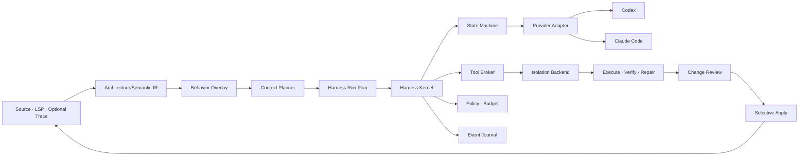

# Witch Engineering Core v0 보완 명세

<!-- witch-doc-languages: ko,en -->

> **한국어:** 분석 깊이, Agent 실행, Harness 커널과 안전한 변경 흐름을 강화하기 위한 Witch 0.3 Engineering Core 요구사항과 구현 진행 기록입니다.
>
> **English:** This specification defines Witch 0.3 Engineering Core requirements and implementation progress across analysis depth, Agent execution, the Harness kernel, and safe change workflows.

- 문서 상태: 구현 진행 중
- 목표 버전: Witch 0.3 Engineering Core
- 기준 구현: Witch 0.2 이후 현재 로컬 작업 트리
- 우선순위: 패키징·배포 갱신 이전
- 적용 영역: 분석 깊이, Agent 실행, Harness 커널, 안전한 변경

이 문서에서 `MUST`는 구현이 반드시 지켜야 하는 조건, `SHOULD`는 특별한 이유가
없으면 지켜야 하는 조건, `MAY`는 선택 기능을 뜻한다.

### 구현 진행 기록

- 2026-09-01 · 단계 0 완료
  - `witch.engineering-run/v1` shared type과 기본 Ask/Change budget 추가
  - 상태 전이 validator, payload hash, sequence/idempotency 검사와 deterministic reducer 추가
  - Provider-neutral context, plan, tool, verification, checkpoint, review event 계약 추가
  - 기존 `AgentRun`을 원본 변경 없이 replay 가능한 legacy event로 투영
  - 상태 전이, tamper/gap 거부, tool lifecycle, legacy review replay 단위 테스트 추가
- 2026-09-01 · 단계 1 Harness Kernel 완료
  - 기존 `history.json` 호환 저장을 유지하면서 모든 새 실행을
    `{userData}/engineering-runs/<runId>/events.ndjson`에 dual-write
  - event append fsync, atomic manifest, payload hash·sequence·digest replay 검증 추가
  - append 이후 manifest 갱신 전에 중단된 경우에만 prefix 검증 후 manifest 자동 복구
  - Codex·Claude session/message와 Provider command lifecycle을 공통 event로 투영
  - 실행 시간·Provider turn·tool/process/file budget accounting 추가
  - 재시작 시 비종료 journal을 `interrupted`로 결정적으로 복구
  - journal tamper/partial record/manifest mismatch에서 apply를 fail closed
  - Chat panel에 Harness state, event count, journal 건강 상태 표시
- 2026-09-01 · 단계 2 Checkpoint·Verification·Review 복원 완료
  - `WorkspaceIsolationBackend` 계약과 기본 `workspace-copy` backend 분리
  - immutable baseline과 stopped review를 manifest/hash 기반 checkpoint artifact로 저장
  - checkpoint의 전체 diff를 재생하고 tamper를 거부하는 reader 추가
  - Provider 완료 주장과 분리된 changed-source syntax·isolated architecture receipt 추가
  - verification 통과/실패·checkpoint 수를 Chat panel Harness 상태에 표시
  - archive payload hash 검증과 현재 baseline 위에 새 child run을 만드는 restore/fork 추가
  - 선택 apply path만 분석 cache에서 invalidate하고 Architecture delta receipt 기록
  - 프로젝트 정의 command는 자동 실행하지 않고 정적 검증만 기본 수행
- 2026-09-01 · 단계 3 Agent Plan·Repair 완료
  - Provider 자연어와 분리된 deterministic `EngineeringPlan`을 실행 전에 journal에 고정
  - 계획 expected file과 실제 diff의 unexpected/missing file을 `plan.evaluated`로 기록
  - syntax/architecture 실패 receipt만 전달하는 최대 2회 bounded repair loop 추가
  - 실패 receipt와 실제 변경 hash 기반 fingerprint 반복 시 즉시 중단
  - 각 repair의 시작·완료·checkpoint·중단 사유를 replay 가능한 event로 보존
  - 최신 verification intent별 결과, repair 수, 계획 밖 변경을 Chat panel에 표시
  - native resume/fork는 Provider capability가 있을 때만 IPC와 UI control을 노출
  - 서로 다른 Provider fork가 같은 source revision과 immutable baseline을 쓰는 회귀 테스트 추가
  - 현재 Codex/Claude adapter는 capability를 false로 보고하므로 control이 표시되지 않음
- 2026-09-01 · 단계 4 Behavior Overlay 완료
  - Architecture/Semantic IR을 변경하지 않는 별도 `witch.behavior/v1` 계약과
    fail-closed validation receipt 추가
  - TypeScript/JavaScript TypeChecker direct call의 parameter binding과 명시적 return
    flow를 Verified로 추출
  - Python positional/keyword와 Rust direct internal call binding을 Inferred로 추출하고
    spread, variadic, property/dynamic dispatch는 후보에서 제외
  - 기존 source-backed state access를 `reads-state` / `writes-state`로 투영
  - Meaning에 Behavior lens, relation provenance/evidence inspector와 Workflow
    input/output/side-effect summary 추가
  - Agent semantic dossier에 현재 semantic revision과 일치하는 bounded behavior packet 추가
  - 고정 10개 저장소에서 Architecture/Semantic/Behavior receipt 10/10 유효,
    invalid receipt 0과 relation 29,019건 확인
- 2026-09-01 · 단계 5 Framework Adapter 완료
  - 공통 parser와 분리된 `witch.framework/v1` candidate, coverage, exclusion
    diagnostic 계약과 fail-closed validator 추가
  - FastAPI decorator/add_api_route, LangGraph node/edge/conditional edge,
    Celery task/enqueue/named task adapter 추가
  - Express route, NestJS controller method, Next.js App Route/Pages API/server
    action adapter 추가
  - Axum Router route, Tokio spawn/JoinSet/mpsc send·receive adapter 추가
  - 모든 accepted candidate를 framework, adapter version, rule ID, candidate ID,
    exact source evidence가 있는 Behavior relation으로 투영
  - Meaning에 `Frameworks · Routes & tasks` lens와 adapter coverage/exclusion
    diagnostics UI, Agent framework dossier 추가
  - framework별 최소 2개 positive와 2개 negative fixture에서 동적 path,
    lambda/property handler, async block, 미해결 endpoint가 관계로 승격되지 않음을 검증
  - 고정 10개 저장소에서 receipt 10/10 유효, detection 156, candidate 153,
    정당한 dynamic-path exclusion 2건 확인
- 2026-09-02 · 단계 6 Evaluation · Optional Runtime Trace 완료
  - `witch.runtime-trace/v1` 세션/event/validation 계약과 별도 `observed`
    Behavior relation 투영 추가
  - 승인된 Project Task에만 trace를 연결하고 일반 PTY 출력은 저장하지 않으며,
    `WITCH_TRACE_V1`의 allowlist 구조 필드 외 marker는 전체 폐기
  - 현재 Architecture/Semantic revision과 정확히 일치하는 reading에만
    Static/Observed/Compare overlay 허용
  - Task 명령·cwd·환경 변수 이름은 SHA-256 command receipt로만 영속화하고
    인자값, 반환값, 환경값, 일반 출력의 저장 건수는 항상 0으로 검증
  - `witch.evaluation/v1` fixture runner와 provider별 분리 score matrix 추가
  - Fake Provider 평가는 기본 offline/deterministic, Live Provider 평가는 코드 opt-in,
    명시 승인, `WITCH_LIVE_EVAL=1`을 모두 요구
  - provider JSON 절단, tool exit, checkpoint, reload/quit, 외부 변경, 검증 loop,
    oversized diff, symlink scope, 승인 전 stop fault matrix와 read-only replay 검증 추가

## 1. 목적

Witch 0.2는 로컬 ADE, source-grounded Architecture/Semantic IR, Codex·Claude
Code Provider, 격리 복사본 변경과 diff 검토를 제공한다. 다음 단계의 목적은 기능
수를 늘리는 것이 아니라 다음 폐쇄 루프를 신뢰할 수 있는 Engineering 시스템으로
완성하는 것이다.

```text
분석 → 컨텍스트 계획 → Agent 계획 → 격리 실행 → 검증 → 제한적 수리
     → 변경 검토 → 선택 적용 → 증분 재분석
```

Witch는 Agent의 자연어 설명을 완료 근거로 사용하지 않는다. 완료 여부는 실제 파일,
프로세스 결과, 검증 receipt와 다시 검증된 분석 IR을 기준으로 판정한다.

## 2. 현재 기준선

### 2.1 이미 구현된 기반

- `witch.architecture/v1`: source-backed 파일·모듈·import 관계와 validation receipt
- `witch.semantic/v1`: System, Component, Workflow, WorkflowStep, File, Symbol,
  trust/status/evidence와 OpenQuestion
- Python, Rust, TypeScript/JavaScript 심볼·일부 호출·타입·상태 접근 분석
- Pyright와 선택적 rust-analyzer corroboration
- Workflow graph/sequence, branch collapse, Summary-first Workflow catalog
- Codex App Server와 Claude Code CLI의 Provider adapter
- Ask/Change 모드, streaming, stop, provider session identity
- workspace copy, immutable baseline, diff 검토, 선택 적용, recovery journal
- Node/Python debugger, Task, PTY, LSP, 파일 감시와 외부 변경 충돌 처리

### 2.2 현재 한계

- direct call의 인자·일부 반환값·module state flow만 있으며 객체 필드·메시지·DB
  lineage와 dynamic dispatch는 아직 없다.
- 지원 adapter 밖의 프레임워크와 alias/re-export/macro-generated registration은 놓칠 수 있다.
- 정적 후보와 실제 runtime에서 관측한 실행을 대조할 계약이 없다.
- Agent plan/verify/repair는 정적 syntax·architecture receipt까지만 자동화되어 있다.
- 실제 Codex/Claude adapter의 native resume/fork와 model/thinking/permission 선택은 아직 지원하지 않는다.
- Provider event journal은 구현됐지만 장기 보존량 정책과 압축은 아직 없다.
- Tool 요청의 권한·예산·승인 결정을 한 곳에서 중재하는 Tool Broker가 없다.
- 단계별 checkpoint와 archive review 복원은 구현됐지만 일반 timeline 탐색 UI는 없다.
- 격리 backend 계약은 분리됐지만 실제 구현은 workspace copy 하나뿐이다.

## 3. 목표와 비목표

### 3.1 목표

1. 호출뿐 아니라 값, 상태, 외부 효과와 제어 흐름을 근거와 함께 표현한다.
2. Agent 작업을 `plan → execute → verify → repair → review`로 관리한다.
3. Provider와 무관한 상태·이벤트·도구·예산·감사 커널을 만든다.
4. 모든 코드 변경을 격리하고 단계별로 복구·검토·선택 적용할 수 있게 한다.
5. 동일한 fixture에서 Codex와 Claude의 결과를 재현 가능한 지표로 비교한다.
6. 현재 Architecture/Semantic IR의 fail-closed 성질을 유지한다.

### 3.2 비목표

- 프로젝트를 열었다는 이유만으로 코드, build, test, migration을 실행하지 않는다.
- AI 추론을 `Verified` source fact로 승격하지 않는다.
- 모든 Python dynamic dispatch, Rust macro expansion, JavaScript runtime monkey patch를
  정적으로 해결한다고 주장하지 않는다.
- Git UI, stage/commit/branch 제품 기능을 이 milestone에 추가하지 않는다.
- Remote Workspace 단계 B–D를 이 milestone에 포함하지 않는다.
- 금융 주문, SSH 명령, Git push, 외부 컴퓨터 제어를 자동 승인하지 않는다.
- Codex나 Claude의 비공개 내부 프로토콜을 Witch의 영속 저장 형식으로 사용하지 않는다.

## 4. 통합 아키텍처



### 4.1 신뢰 경계

신뢰도는 다음 순서로 구분한다. 아래 순서는 우선순위가 아니라 출처의 종류다.

| 신뢰 종류  | 의미                                           | 허용 출처                                 |
| ---------- | ---------------------------------------------- | ----------------------------------------- |
| `verified` | 소스 또는 compiler/LSP가 양 끝점을 명확히 해결 | static analyzer, bounded language server  |
| `inferred` | 정적 규칙 또는 AI가 근거를 인용해 제안         | heuristic, framework adapter, AI composer |
| `authored` | 사용자가 저장소 규칙으로 선언                  | `.witch/analysis.json`                    |
| `observed` | 사용자가 명시적으로 시작한 실행에서 관측       | Witch runtime trace session               |

`observed`는 특정 실행의 사실일 뿐 모든 실행에 대한 일반 진실이 아니다. 따라서
`verified`를 덮어쓰지 않고 별도 trace/session identity를 MUST로 가진다.

## 5. 축 1 — 분석 깊이

### 5.1 Behavior Overlay

현재 `witch.architecture/v1`과 `witch.semantic/v1`은 그대로 유지한다. 깊은 행동·데이터
관계는 별도의 `witch.behavior/v1` 계약에 저장한다. 이 오버레이는 기존 semantic node
ID를 참조하며 원본 IR을 수정하거나 유효하지 않은 endpoint를 만들 수 없다.

```ts
type BehaviorTrust = "verified" | "inferred" | "authored" | "observed";

type BehaviorRelationKind =
  | "passes"
  | "returns"
  | "produces"
  | "consumes"
  | "reads-state"
  | "writes-state"
  | "persists"
  | "publishes"
  | "subscribes"
  | "spawns"
  | "raises"
  | "handles"
  | "routes-to";

type BehaviorValue = {
  id: string;
  label: string;
  shape?: string;
  sensitivity?: "unknown" | "public" | "internal" | "sensitive";
  sourceNodeId: string;
};

type BehaviorRelation = {
  id: string;
  from: string;
  to: string;
  kind: BehaviorRelationKind;
  valueId?: string;
  trust: BehaviorTrust;
  confidence: number;
  status: "accepted" | "provisional" | "corroborated" | "conflicting";
  evidence: SourceEvidence[];
  provenance: {
    analyzer: string;
    version: string;
    policy: string;
    traceSessionId?: string;
  };
};

type BehaviorGraph = {
  contract: "witch.behavior/v1";
  sourceRevision: string;
  semanticRevision: string;
  values: BehaviorValue[];
  relations: BehaviorRelation[];
  validation: BehaviorValidationReceipt;
};
```

### 5.2 정적 데이터 흐름 수용 범위

초기 구현은 다음 순서로 제한한다.

#### TypeScript/JavaScript

- 동일 함수 안의 identifier assignment와 return은 `verified`로 MAY 표시한다.
- TypeChecker가 parameter/return symbol과 direct call target을 모두 해결한 경우
  `passes`와 `returns`를 `verified`로 표시한다.
- property call의 runtime dispatch가 불명확하면 endpoint를 확정하지 않는다.
- object field는 동일 declaration으로 명확히 해석되는 경우만 `inferred`로 허용한다.

#### Python

- 동일 모듈 또는 명시적으로 해결된 internal import의 직접 함수 호출만 다룬다.
- keyword/positional argument와 parameter binding이 정적으로 일치하면 `inferred`다.
- `*args`, `**kwargs`, monkey patch, descriptor, dynamic import가 경계에 있으면 생략한다.

#### Rust

- 동일 crate의 명시적 function/method와 고유한 trait implementation만 다룬다.
- rust-analyzer가 call target/type를 corroborate하면 `corroborated`로 승격할 수 있다.
- macro-generated, blanket impl, associated type ambiguity는 생략한다.

### 5.3 Side effect 분류

분석기는 다음 side effect 후보를 표시할 수 있다.

- 파일 쓰기
- 데이터베이스 query/transaction
- HTTP/RPC 요청
- message publish/subscribe
- process/task spawn
- cache read/write
- 로그·metric·trace emit

이 관계는 library/framework adapter가 인식한 signature와 실제 call evidence를 모두 가져야
한다. 단순 함수 이름만으로 `verified`를 만들 수 없다.

### 5.4 Framework Adapter 계약

Framework adapter는 공통 parser를 수정하지 않고 candidate를 제출한다.

```ts
type FrameworkAdapter = {
  id: string;
  version: string;
  languages: Array<"python" | "rust" | "typescript" | "javascript">;
  detect(input: BoundedRepositoryFacts): FrameworkDetection[];
  analyze(input: FrameworkAnalysisInput): FrameworkCandidate[];
};
```

초기 adapter 우선순위는 다음과 같다.

1. Python: FastAPI, LangGraph, Celery
2. TypeScript: Express, NestJS, Next.js server routes/actions
3. Rust: Axum, Tokio task/channel

Adapter candidate는 다음을 MUST로 포함한다.

- framework와 versioned adapter ID
- source-backed 양 끝점
- exact evidence path/line/hash
- 적용한 규칙 ID
- trust와 confidence
- 동적 해석 때문에 제외한 경우의 bounded diagnostic

### 5.5 Runtime Trace 계약

Runtime trace는 기본적으로 꺼져 있다. 현재 v1은 사용자가 구체적인 Project Task를
선택하고 native dialog에서 승인한 경우에만 시작한다. Debug launch trace는 아직 지원하지 않는다.

```ts
type RuntimeTraceSession = {
  id: string;
  workspaceRoot: string;
  sourceRevision: string;
  startedAt: string;
  completedAt?: string;
  commandReceipt: string;
  status: "running" | "completed" | "failed" | "interrupted";
  events: RuntimeTraceEvent[];
};
```

- trace payload는 기본적으로 함수/심볼 ID, 순서, duration, outcome만 저장한다.
- 인자·반환값의 실제 값은 기본 저장 금지다.
- v1에는 sensitive value capture opt-in 자체가 없으며 allowlist 밖 marker는 전체 폐기한다.
- static relation과 observed relation은 UI에서 겹쳐 볼 수 있지만 합쳐 저장하지 않는다.
- trace 없이 runtime frequency, 실제 branch, 실제 retry count를 주장하지 않는다.

### 5.6 분석 UI

Meaning에 `Behavior · Data flow` lens를 추가한다.

- 기본 화면은 Component 간 value/side-effect summary다.
- 선택한 Workflow에서 step별 input/output/side effect를 표시한다.
- `Static`, `Observed`, `Compare` 필터를 제공한다.
- evidence를 선택하면 정확한 소스 위치를 연다.
- inferred relation은 항상 시각적으로 구분하고 OpenQuestion으로 전환할 수 있다.
- 대형 그래프는 현재 Workflow와 동일하게 summary-first projection을 사용한다.

## 6. 축 2 — Agent 실행 구조

### 6.1 Run Request

```ts
type EngineeringRunRequest = {
  goal: string;
  mode: "ask" | "change";
  providerId: "codex" | "claude";
  contextIds: string[];
  constraints?: string[];
  requestedVerification?: string[];
  model?: string;
  thinking?: string;
  permissionProfileId?: string;
};
```

Renderer가 제공한 context label/path는 신뢰하지 않는다. Main process가 현재 validated graph에서
ID를 다시 해석해야 한다. stale revision은 기존과 같이 거부한다.

### 6.2 Context Planner

Context Planner는 요청, 사용자가 선택한 노드와 validated graph를 입력으로 받고 bounded
context dossier를 만든다.

```ts
type ContextSelection = {
  subjectId: string;
  reason:
    | "user-selected"
    | "direct-relation"
    | "workflow-step"
    | "behavior-flow"
    | "verification-target"
    | "open-question";
  evidenceIds: string[];
  priority: number;
};
```

기본 규칙은 다음과 같다.

- 사용자가 선택한 context는 제거하지 않는다.
- direct semantic/behavior neighbor를 우선한다.
- 대상 소스와 같은 support test를 별도 표시한다.
- 최대 12개 context, 최대 24,000 path characters를 유지한다.
- 제외한 후보 수와 budget reason을 receipt에 남긴다.
- AI 기반 context 제안은 `inferred`이며 graph validator를 우회하지 못한다.

### 6.3 Engineering Plan

Change 모드의 Provider는 파일 변경 전에 구조화된 plan을 제출해야 한다.

```ts
type EngineeringPlan = {
  objective: string;
  assumptions: string[];
  affectedComponents: string[];
  expectedFiles: string[];
  steps: Array<{
    id: string;
    description: string;
    expectedOutcome: string;
  }>;
  verification: VerificationIntent[];
  risks: string[];
};
```

Plan은 허가가 아니라 예상 범위다. Plan 밖 파일 변경은 기록하며 정책에 따라 계속 진행,
승인 요청 또는 중단한다.

### 6.4 실행 루프

```text
created → context-planning → planning → awaiting-approval
        → executing → verifying → repairing → review-ready
        → applied | archived | failed | interrupted
```

- Ask는 `context-planning → executing → completed` 단축 경로를 사용할 수 있다.
- Change는 `planning`, `executing`, `verifying`, `review-ready`를 건너뛸 수 없다.
- `repairing`은 기본 최대 2회다.
- 동일한 verification fingerprint가 두 번 반복되면 자동 repair를 중단한다.
- 완료 응답과 실제 verification이 다르면 verification 결과를 우선한다.

### 6.5 Verification Plan

검증 대상은 프로젝트 설정과 변경 파일로부터 추천하되 실행 전 정책을 적용한다.

```ts
type VerificationIntent = {
  id: string;
  kind:
    | "syntax"
    | "typecheck"
    | "lint"
    | "unit-test"
    | "build"
    | "architecture"
    | "semantic"
    | "custom-task";
  commandId?: string;
  scope: string[];
  required: boolean;
};

type VerificationReceipt = {
  intentId: string;
  status: "passed" | "failed" | "skipped" | "blocked";
  startedAt: string;
  completedAt: string;
  exitCode?: number;
  outputHash?: string;
  boundedOutput?: string;
  changedRevision?: string;
};
```

- Witch 내부 IR validator는 명령 실행 없이 자동 수행한다.
- 프로젝트 명령은 기존 Task 승인 규칙을 재사용한다.
- `skipped`는 `passed`로 표시하지 않는다.
- required verification이 실패하면 `review-ready`는 될 수 있지만 `verified-complete`로
  표시할 수 없다.

### 6.6 Repair

Repair 입력에는 전체 로그가 아니라 실패 receipt, 관련 source evidence와 직전 checkpoint
diff를 전달한다.

기본 제한:

- 최대 repair 2회
- 한 repair에서 신규 파일 최대 12개
- 전체 review 한도 200 files / 12 MB 유지
- 동일 실패 fingerprint 반복 시 중단
- 계획 범위를 크게 벗어나는 변경은 `attention-required`
- 테스트 삭제·약화, lint rule 비활성화, 검증 명령 변경은 별도 정책 event

### 6.7 Resume와 Fork

- Resume은 Provider가 `sessionResume` capability를 명시하고 checkpoint source revision이
  일치할 때만 허용한다.
- Fork는 immutable checkpoint에서 새 run ID와 isolation backend를 만든다.
- Provider native session ID는 Witch run ID를 대체하지 않는다.
- Resume/Fork를 지원하지 않는 Provider에는 UI control을 표시하지 않는다.
- 서로 다른 Provider fork는 같은 baseline과 verification plan을 공유할 수 있다.

## 7. 축 3 — Harness 커널

### 7.1 책임

Harness Kernel은 다음을 소유한다.

- run state와 유효한 상태 전이
- Provider capability negotiation
- Provider-neutral event projection
- Tool Broker와 approval policy
- time/token/file/process/repair budget
- checkpoint와 event journal
- 중단·종료·복구
- verification과 review receipt

Provider adapter는 prompt 전달, native event 변환, stop과 선택적 resume/fork만 담당한다.
원본 적용과 상태 판정 권한을 가지지 않는다.

### 7.2 상태 전이 규칙

```ts
type HarnessRunState =
  | "created"
  | "context-planning"
  | "planning"
  | "awaiting-approval"
  | "executing"
  | "verifying"
  | "repairing"
  | "review-ready"
  | "completed"
  | "applied"
  | "archived"
  | "failed"
  | "interrupted"
  | "attention-required";
```

- 모든 전이는 append-only event로 먼저 저장한 뒤 메모리 상태에 반영한다.
- 허용되지 않은 전이는 오류를 반환하고 기존 상태를 보존한다.
- 동일 idempotency key의 event는 한 번만 적용한다.
- 앱 재시작 시 journal을 replay해 상태를 복구한다.
- 실행 중이던 process가 사라진 run은 `interrupted`로 복구한다.
- terminal state의 journal은 수정하지 않고 새 follow-up run을 만든다.

### 7.3 공통 이벤트

```ts
type HarnessEvent = {
  id: string;
  runId: string;
  sequence: number;
  timestamp: string;
  type:
    | "run.created"
    | "context.selected"
    | "plan.created"
    | "state.changed"
    | "approval.requested"
    | "approval.resolved"
    | "provider.session"
    | "provider.message"
    | "tool.requested"
    | "tool.started"
    | "tool.completed"
    | "file.changed"
    | "checkpoint.created"
    | "verification.completed"
    | "analysis.updated"
    | "review.created"
    | "run.completed"
    | "run.failed";
  payload: unknown;
  payloadHash: string;
};
```

Payload는 event type별 schema validator를 MUST로 가진다. 알 수 없는 event는 저장할 수
있지만 상태를 변경하지 않는 diagnostic으로 격리한다.

### 7.4 Provider Capability Negotiation

현재 capability contract를 실제 UI/실행 제약에 연결한다.

```ts
type ProviderCapabilities = {
  ask: boolean;
  change: boolean;
  streaming: boolean;
  toolEvents: boolean;
  approvals: boolean;
  sessionResume: boolean;
  fork: boolean;
  modelSelection: boolean;
  thinkingSelection: boolean;
  permissionModes: boolean;
};
```

- Provider가 지원하지 않는 control은 비활성화가 아니라 기본적으로 숨긴다.
- adapter descriptor와 실제 event가 불일치하면 run diagnostic을 남긴다.
- Provider-specific raw event는 bounded debug log에 선택적으로 보존할 수 있지만 공통
  journal의 상태 근거로 직접 사용하지 않는다.

### 7.5 Tool Broker

```ts
type ToolRequest = {
  id: string;
  runId: string;
  toolId: string;
  capability: "read" | "write-isolated" | "process" | "network" | "apply";
  argumentsHash: string;
  scope: string[];
  reason: string;
};

type PolicyDecision = {
  requestId: string;
  decision: "allow" | "deny" | "ask";
  policyId: string;
  reason: string;
  budgetDelta?: Record<string, number>;
};
```

기본 정책:

| 작업                         | 기본값                      |
| ---------------------------- | --------------------------- |
| validated context 읽기       | 자동 허용                   |
| 격리 backend 내부 파일 편집  | 자동 허용 + checkpoint 기록 |
| Witch 내부 parser/validator  | 자동 허용                   |
| 사용자가 확인한 project Task | 정책에 따라 허용            |
| 새 shell command             | 사용자 승인                 |
| 네트워크                     | 기본 거부 또는 사용자 승인  |
| 원본 선택 적용               | review에서 사용자 승인      |
| Git push/SSH/CUA/금융 주문   | 자동 승인 금지              |

### 7.6 Budget

```ts
type RunBudget = {
  wallTimeMs: number;
  providerTurns: number;
  tokenEstimate?: number;
  maxChangedFiles: number;
  maxChangedBytes: number;
  maxProcesses: number;
  maxRepairAttempts: number;
  maxToolRequests: number;
};
```

추천 기본값:

| 항목               |  Ask | Change |
| ------------------ | ---: | -----: |
| wall time          | 10분 |   30분 |
| provider turns     |    8 |     24 |
| changed files      |    0 |    200 |
| changed bytes      |    0 |  12 MB |
| concurrent process |    1 |      2 |
| repair             |    0 |      2 |
| tool requests      |   40 |    120 |

예산 초과는 원본 적용을 하지 않고 `attention-required`로 전환한다. 사용자가 새 예산을
승인하면 동일 run이 아니라 parent를 참조하는 continuation run을 생성하는 것을 기본으로 한다.

### 7.7 Event Journal과 Replay

저장 위치는 repository 밖 `{userData}/engineering-runs/<runId>`다.

```text
engineering-runs/<runId>/
  manifest.json
  events.ndjson
  plan.json
  context-receipt.json
  checkpoints/
  verification/
  review/
  provider-debug/       # optional, bounded
```

- manifest/events/receipt는 temporary file, fsync, atomic replace를 사용한다.
- event sequence gap, hash mismatch, oversized payload는 fail closed 한다.
- replay는 Provider를 호출하거나 command를 다시 실행하지 않는다.
- replay UI는 당시 message, tool, file, verification, approval 순서를 재현한다.
- secret 값, terminal input, API key, raw sensitive runtime value는 journal에 저장하지 않는다.

### 7.8 오류 분류

| 오류         | 예                                  | 처리                                        |
| ------------ | ----------------------------------- | ------------------------------------------- |
| Provider     | 인증, malformed event, process exit | stop 후 partial review 가능 여부 판정       |
| Policy       | 권한 거부, scope 위반               | 요청 거부, run은 계속 또는 attention        |
| Budget       | 시간·파일·repair 초과               | attention-required                          |
| Verification | test/typecheck 실패                 | bounded repair 또는 review-ready failed     |
| Storage      | journal/checkpoint 저장 실패        | 변경 중단, 원본 적용 금지                   |
| Conflict     | baseline 이후 원본 변경             | apply 거부, rebase/fork 제안                |
| Shutdown     | 앱 종료·renderer reload             | owned process 정리, replay 가능한 상태 저장 |

## 8. 축 4 — 안전한 변경 Engineering

### 8.1 Isolation Backend

```ts
interface IsolationBackend {
  readonly kind: "workspace-copy" | "git-worktree" | "container";
  prepare(input: IsolationRequest): Promise<IsolationReceipt>;
  checkpoint(label: string): Promise<CheckpointReceipt>;
  collectChanges(): Promise<ChangeSet[]>;
  verifyBaseline(): Promise<BaselineReceipt>;
  dispose(): Promise<void>;
}
```

0.3의 MUST backend는 기존 `workspace-copy`다. `git-worktree`는 실험 기능, `container`는
계약만 정의하고 구현 범위 밖으로 둔다.

### 8.2 Snapshot과 Checkpoint

```text
Original
  └─ Immutable baseline
       ├─ checkpoint: planned
       ├─ checkpoint: execution-1
       ├─ checkpoint: repair-1
       └─ checkpoint: final-candidate
```

Checkpoint receipt:

```ts
type CheckpointReceipt = {
  id: string;
  parentId?: string;
  runId: string;
  createdAt: string;
  sourceRevision: string;
  changedPaths: string[];
  manifestHash: string;
  totalBytes: number;
};
```

- checkpoint는 full copy 또는 content-addressed delta로 구현할 수 있다.
- 어떤 구현도 baseline 파일을 Agent가 수정할 수 있게 노출하면 안 된다.
- checkpoint 실패 후 Agent 실행을 계속할 수는 있지만 그 이후 변경은 자동 적용 후보가
  될 수 없다.

### 8.3 ChangeSet

```ts
type ChangeSet = {
  id: string;
  title: string;
  rationale: string;
  paths: string[];
  dependencies: string[];
  checkpointId: string;
  planStepIds: string[];
  verificationReceiptIds: string[];
  status: "candidate" | "verified" | "failed" | "selected" | "applied";
};
```

Agent가 제안한 grouping은 참고값이다. 실제 path와 diff에서 다시 계산하고, 존재하지 않는
path나 다른 checkpoint의 변경을 포함하면 거부한다.

### 8.4 적용 전 검증

원본 적용 전 다음을 모두 검사한다.

1. workspace root identity와 run root가 일치한다.
2. 선택 path가 root 내부이며 symlink/junction/Git metadata를 통과하지 않는다.
3. baseline hash와 현재 원본 hash가 일치한다.
4. 선택하지 않은 파일이 apply payload에 포함되지 않는다.
5. recovery journal이 fsync 됐다.
6. 변경 합성본의 encoding/BOM/line ending을 보존한다.
7. required internal validator가 통과하거나 실패가 명시적으로 표시된다.

하나라도 실패하면 partial overwrite를 시도하지 않는다.

### 8.5 선택 적용과 의존성

- 사용자는 ChangeSet 또는 파일 단위로 선택할 수 있다.
- 선택한 ChangeSet이 선택하지 않은 dependency를 요구하면 UI가 경고한다.
- Witch가 임의로 dependency 파일을 추가 선택하지 않는다.
- 적용은 recovery journal을 가진 bounded transaction으로 수행한다.
- 적용 도중 실패하면 완료된 파일 목록과 복구 가능 상태를 명확히 표시한다.
- 적용 성공 뒤 Architecture/Semantic/Behavior 증분 재분석을 수행한다.

### 8.6 Review 복원

현재 archive는 diff를 보존하지만 UI 복원을 지원하지 않는다. 0.3에서는 다음을 MUST로 한다.

- archive 목록 열기
- immutable diff와 verification receipt 재표시
- staging directory가 남아 있으면 새 run으로 fork
- 원본 revision이 달라졌으면 직접 apply 대신 conflict 표시
- archive 삭제는 별도 명시적 사용자 작업

과거 archive 형식은 read-only legacy item으로 보이고 손실 없이 유지한다.

### 8.7 자동 승인 감사

자동 승인된 모든 작업은 `PolicyDecision` event를 남긴다.

```text
allow · write-isolated · policy isolated-edit/v1
allow · internal-validator · policy safe-read/v1
ask  · custom-task · policy executable-task/v1
deny · git-push · policy external-mutation/v1
```

자동 승인은 원본 파일, Git, SSH, 네트워크, CUA, 금융 시스템으로 확장되지 않는다.

## 9. UI 요구사항

### 9.1 Agent Run 화면

- 현재 phase와 전체 상태를 항상 표시한다.
- plan, context selection reason, budget 사용량을 접을 수 있는 panel로 제공한다.
- tool 요청·결과와 policy decision을 timeline에 표시한다.
- verification은 passed/failed/skipped/blocked를 구분한다.
- repair 횟수와 각 checkpoint diff를 비교할 수 있다.
- `completed`와 `verified`를 다른 badge로 표시한다.
- attention-required에서 필요한 사용자 결정만 한 문장으로 제시한다.

### 9.2 Review 화면

- Plan 예상 파일과 실제 변경 파일 차이를 표시한다.
- ChangeSet, 파일, checkpoint 기준 diff를 전환한다.
- 실패한 verification과 관련 파일을 연결한다.
- 선택 적용 뒤 의미 그래프에서 추가·변경·삭제 관계를 보여준다.
- Provider의 자연어 요약은 실제 diff/receipt보다 시각적 우선순위가 낮아야 한다.

### 9.3 Replay 화면

- replay는 읽기 전용이다.
- 시간순 event, state transition, approval, tool, checkpoint를 표시한다.
- raw provider debug log는 개발자 설정에서만 열 수 있다.
- replay에서 실행/적용 버튼을 제공하지 않는다. 새 run fork만 허용한다.

## 10. Evaluation Harness

### 10.1 목적

동일한 baseline, dossier, prompt, budget, verification plan을 사용해 Provider와 Harness
변경의 품질을 비교한다.

### 10.2 Fixture 구성

```text
evals/<caseId>/
  project/
  request.json
  expected-scope.json
  assertions.json
  allowed-commands.json
```

일반 테스트는 fake Provider를 사용한다. 실제 Codex/Claude 평가는 명시적 환경 변수와
비용 경고가 있을 때만 실행한다.

### 10.3 지표

- 요구사항 assertion 통과율
- typecheck/test/build 통과율
- 예상 범위 안의 변경 비율
- 계획 밖 파일 수
- diff 크기와 불필요 변경
- source evidence 인용률
- verification을 거짓으로 완료 주장한 횟수
- repair 횟수와 동일 실패 반복
- wall time, provider turn, token/API 비용
- 원본 격리와 apply conflict 처리
- replay deterministic hash

Provider 순위 하나로 합치기보다 지표별 결과를 보존한다.

### 10.4 Fault Injection

최소 다음 상황을 자동 테스트한다.

- Provider가 중간 JSON/event를 잘라서 출력
- tool start 뒤 process가 종료
- checkpoint 저장 실패
- renderer reload
- 앱 종료
- 원본 파일이 실행 중 외부 변경
- 동일 verification 실패 반복
- oversized diff
- scope 밖 파일과 symlink 변경
- approval 응답 전에 run stop

## 11. 영속 저장과 마이그레이션

- 기존 Agent history는 변경하지 않고 read-only migration source로 사용한다.
- 새 run은 `engineering-runs/v1` manifest로 저장한다.
- 기존 run은 첫 열기에서 즉시 rewrite하지 않는다.
- 사용자가 legacy run을 열면 adapter가 in-memory replay model로 투영한다.
- archive와 recovery 원본은 migration 성공 후에도 자동 삭제하지 않는다.
- schema version이 새로운 경우 구버전 Witch는 해당 run을 읽기 전용 unknown item으로
  보존해야 한다.

## 12. 보안과 개인정보

- API key, SSH secret, private key, terminal input은 journal payload에 포함하지 않는다.
- source excerpt는 기존 dossier 한도를 유지하고 audit/export 시 민감할 수 있음을 알린다.
- runtime actual value capture는 기본 금지다.
- provider raw event는 4 MB/run 기본 상한과 보존 기간 설정을 가진다.
- Agent가 생성한 path, command, label은 모두 untrusted input으로 처리한다.
- renderer는 Tool Broker나 Isolation Backend를 직접 호출할 수 없다.
- apply, process, provider는 typed preload IPC와 main-process validation을 거친다.
- Provider prompt injection은 완전히 방지된다고 주장하지 않으며 tool policy로 피해 범위를
  제한한다.

## 13. 성능과 규모 기본값

| 항목                  |                              기본 상한 |
| --------------------- | -------------------------------------: |
| Behavior relation     |                   repository당 200,000 |
| Behavior value        |                    repository당 50,000 |
| Framework diagnostic  |                          adapter당 200 |
| Runtime trace event   |                       session당 10,000 |
| Harness event payload |                         event당 256 KB |
| Harness journal       |                           run당 150 MB |
| Checkpoint workspace  |              기존 isolated work 250 MB |
| Review                |                      200 files / 12 MB |
| Context               | 12 selections / 24,000 path characters |
| Repair                |                                    2회 |

한도에 도달하면 일부 결과를 조용히 누락하지 않고 validation/coverage diagnostic을 남긴다.

## 14. 구현 단계

### 단계 0 — 계약 고정

- `engineering-run`, `harness-event`, `policy`, `budget`, `checkpoint` shared type
- 상태 전이 validator와 deterministic reducer
- schema version과 저장 layout
- 기존 AgentRun을 legacy projection으로 읽는 adapter

수용 기준:

- 모든 허용/비허용 전이 단위 테스트
- 동일 event replay 결과 hash 일치
- malformed/oversized journal fail closed

### 단계 1 — Harness Kernel

- Provider-neutral event adapter
- append-only journal
- budget accounting
- Tool Broker와 기존 Codex/Claude adapter 연결
- 현재 Ask/Change UI를 새 state model에 연결

수용 기준:

- 기존 Agent E2E가 기능 회귀 없이 새 journal을 생성
- stop/reload/quit 후 상태가 결정적으로 복구
- Provider descriptor와 UI capability 일치

### 단계 2 — Checkpoint·Verification·Review 복원

- workspace-copy backend 추상화
- 단계별 checkpoint
- Verification Plan/Receipt
- archive review 복원과 fork
- 선택 적용 후 증분 분석 delta

수용 기준:

- checkpoint별 diff 재현
- 외부 원본 변경 시 apply 거부
- archive 복원은 원본/staging을 수정하지 않음
- verification 실패가 verified-complete로 표시되지 않음

### 단계 3 — Agent Plan·Repair

- EngineeringPlan structured output
- 계획 범위와 실제 변경 대조
- bounded repair loop
- resume/fork capability UI

수용 기준:

- 최대 repair와 동일 fingerprint 중단
- 계획 밖 파일 변경 diagnostic
- resume 미지원 Provider에 control 미노출
- 두 Provider fork가 같은 baseline을 사용

### 단계 4 — Behavior Overlay

- `witch.behavior/v1` validator와 receipt
- TS direct parameter/return flow
- 보수적 Python/Rust argument binding
- Behavior lens와 Workflow input/output/side-effect summary

수용 기준:

- 모든 relation에 endpoint/evidence/provenance 존재
- ambiguous/dynamic candidate 제외 회귀 테스트
- 기존 Architecture/Semantic relation count와 receipt 불변
- 10-repository fixed benchmark에서 invalid receipt 0

### 단계 5 — Framework Adapter

- FastAPI, LangGraph, Celery
- Express/NestJS/Next server
- Axum/Tokio
- adapter coverage/limit diagnostics

수용 기준:

- framework별 최소 2개 positive/negative fixture
- rule ID와 evidence 없는 candidate 거부
- 프로젝트 open만으로 framework code 실행 0

### 단계 6 — Evaluation·Optional Trace · 완료

- Provider 비교 fixture runner
- fault injection
- runtime trace 최소 계약
- Static/Observed compare UI

수용 기준:

- fake Provider evaluation은 offline·deterministic
- live Provider test는 명시적 opt-in
- trace actual value 기본 저장 0
- replay 중 provider/tool 재실행 0

## 15. 품질 게이트

각 단계는 다음을 모두 통과해야 다음 단계로 간다.

```text
npm run typecheck
npm test
npm run build
npm run test:e2e
```

추가 게이트:

- fixed 10-repository analysis benchmark
- Agent isolation/apply conflict E2E
- journal corruption/replay test
- Provider malformed event test
- Windows source E2E
- macOS CI source E2E는 패키징 직전 필수

분석 성능은 동일 corpus에서 relation 결과가 같은 상태로 비교한다. cold/warm 시간이 25%
이상 악화되면 원인을 기록하고 최적화 또는 명시적 승인 없이 병합하지 않는다.

## 16. Definition of Done

Engineering Core v0는 다음 조건을 만족해야 완료다.

1. Codex와 Claude Change run이 동일 Harness 상태·event·policy 계약을 사용한다.
2. 모든 run을 Provider 재호출 없이 replay할 수 있다.
3. Change run은 plan, checkpoint, verification, review receipt를 가진다.
4. 자동 repair는 bounded하며 같은 실패를 무한 반복하지 않는다.
5. Agent 완료 주장과 실제 검증 결과가 분리되어 표시된다.
6. archive review를 읽기 전용으로 복원하고 새 run으로 fork할 수 있다.
7. apply는 baseline conflict, path escape, journal failure에서 fail closed 한다.
8. Behavior relation은 기존 IR을 약화시키지 않고 별도 validation receipt를 가진다.
9. 프레임워크 adapter가 프로젝트 코드를 실행하지 않는다.
10. 10개 benchmark, 전체 unit/integration/E2E, production build가 통과한다.

## 17. 패키징 재개 조건

다음 조건 전에는 새 공개 Release 패키징을 우선하지 않는다.

- 단계 0–4 완료
- 기존 103개 이상 unit/integration 회귀 통과
- 전체 Electron E2E 통과
- Codex와 Claude fake-provider end-to-end fixture 통과
- 최소 1회 실제 Codex, 1회 실제 Claude opt-in smoke 결과 기록
- archive 복원과 interrupted run replay 검증
- 10-repository Behavior benchmark 결과 작성
- README, implementation status, verification 문서의 Provider/기능 설명 동기화

단계 5–6은 0.3 프리뷰 이후에도 확장할 수 있지만, 계약과 validator는 패키징 전에 고정해야
한다.
