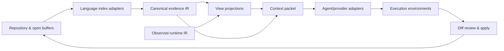

# Witch GitHub 프로젝트 비교 조사 보고서

<!-- witch-doc-languages: ko,en -->

> **한국어:** 인터랙티브 코드 구조 탐색과 ADE/Agent 작업 흐름을 제공하는 공개 프로젝트들을 조사하고 Witch의 위치, 격차와 차별화 방향을 비교합니다.
>
> **English:** This landscape report surveys public interactive code-structure and ADE/Agent projects, then compares Witch's position, gaps, and differentiation opportunities.

> 인터랙티브 코드 구조 탐색과 AI-native ADE의 교차점

- 조사일: 2026-08-30
- Witch 기준: 로컬 `main`, commit `7bae0e3`
- 조사 대상: GitHub 프로젝트 20개
- 조사 방식: 각 프로젝트의 공식 GitHub README, 저장소 메타데이터, 라이선스 파일과 공식 문서만 사용
- 범위 제한: 이번 조사는 소스와 문서 비교다. 제3자 프로젝트를 설치해 동일 데이터셋으로 성능·정확도를 재측정하지는 않았다.
- 후속 결정: [Python·Rust·TypeScript semantic analysis policy](semantic-analysis-policy.md)

## 1. 결론

Witch가 노려야 할 자리는 단순한 "AI가 붙은 코드 에디터"도, 단순한 "코드 그래프 뷰어"도 아니다. 조사한 20개 프로젝트 안에서 가장 설득력 있는 포지션은 다음 세 층을 하나의 작업 흐름으로 연결하는 **검증 중심의 시각적 ADE**다.

1. 실제 소스에서 만든 증거 기반 구조 모델
2. 그래프에서 파일·심볼·근거 줄로 왕복하는 인터랙티브 탐색
3. 선택한 구조 문맥을 AI에 전달하고, 격리된 변경을 diff로 검토한 뒤 적용하는 ADE

각 층에는 이미 강한 선행 프로젝트가 있다. [CodeBoarding](https://github.com/CodeBoarding/CodeBoarding)은 계층적 아키텍처 지도, [GitNexus](https://github.com/abhigyanpatwari/GitNexus)는 심볼·호출·영향 그래프와 Agent용 MCP, [Archify](https://github.com/tt-a1i/archify)는 검증된 typed IR과 진실한 인터랙션, [Orca](https://github.com/stablyai/orca)는 Agent worktree 오케스트레이션, [Eclipse Theia](https://github.com/eclipse-theia/theia)는 독립 IDE 제품을 만드는 확장 구조에서 각각 가장 직접적인 참고 대상이다.

반면 이 교차점을 완성한 단일 프로젝트는 조사군에서 확인하지 못했다. CodeBoarding·GitNexus·Archify는 완전한 ADE가 아니며, Orca·Cline·OpenHands는 구조 그래프가 핵심이 아니다. VS Code·Theia·Zed·Lapce는 IDE 기반이 강하지만, 소스 증거를 중심으로 한 아키텍처 캔버스를 기본 작업 모델로 삼지 않는다. 따라서 Witch를 이들 중 하나의 얇은 스킨으로 바꾸기보다, **독립 앱을 유지하면서 분석기·Agent·실행 환경을 교체 가능한 프로토콜로 연결하는 방향**이 타당하다.

가장 중요한 판단은 다음과 같다.

- CodeBoarding의 계층적 추상화와 증분 분석, GitNexus의 심볼 수준 인덱스, Sourcetrail의 선택 중심 탐색 UX를 Witch Constellation의 다음 기준으로 삼는다.
- Archify에서 가져온 "검증된 사실만 인터랙션에 사용" 원칙은 유지한다. 정적 import를 런타임 call/data flow로 과장하지 않는다.
- Orca의 worktree 수명주기와 Cline의 공급자·도구 승인 모델은 참고하되, 해당 앱에 런타임 종속되지는 않는다.
- VS Code 포크는 선택하지 않는다. Void와 Aide의 종료는 포크 유지 비용이 제품의 차별 기능 개발을 압도할 수 있음을 보여 준다.
- CUA는 편집기 핵심이 아니라 선택적 실행 계층이다. VM·샌드박스·명시적 권한·trajectory 기록 없이 호스트 제어를 기본 기능으로 만들면 안 된다.
- Witch 저장소에는 현재 루트 라이선스 파일이 없다. 외부 배포·기여·코드 재사용 정책을 명확히 하기 전에 반드시 제품 라이선스를 결정해야 한다.

## 2. Witch의 현재 기준선

현재 Witch는 [README](../README.md), [구현 현황](implementation-status.md), [구조 뷰 계약](architecture-views.md), [검증 기록](verification.md)을 기준으로 다음 상태다.

### 이미 구현된 강점

- Electron 44, React 19, Monaco 기반의 독립 데스크톱 ADE다. Orca나 VS Code 포크에 런타임 종속되지 않는다.
- 파일 CRUD, 탭 편집, 프로젝트 검색, TS/JS LSP, Node JavaScript 디버그, 다중 PTY 터미널, Task, 설정·단축키·테마·스니펫, 외부 파일 감시를 한 앱에서 제공한다.
- `witch.architecture/v1` typed IR에 stable node ID, source hash, relation ID와 evidence line을 보관하고, 검증을 통과한 결과만 기록과 UI에 전달한다.
- Modules, Files, 활성 파일의 1-hop Focus, authored edge만 따르는 upstream/downstream reach와 route, Before/Delta/After, 오프라인 HTML/JSON 내보내기를 지원한다.
- 그래프 컴포넌트를 Agent 문맥으로 첨부할 수 있다. Codex CLI 변경은 필터링한 격리 복사본에서 실행하며, 실제 파일 diff를 검토하고 선택한 파일만 원본에 적용한다.
- 현재 검증 기록은 TypeScript unit test 57개, Electron source E2E 21개, Windows/macOS 패키지 체인의 통과를 구분해 기록한다.

### 현재의 구조적 한계

- 정확한 의미 분석은 TS/JS 중심이며 Python은 제한적이다. Java, C/C++, C#, Go, Rust 등은 심볼·호출 그래프가 없다.
- canonical graph의 주된 관계는 파일 import/re-export다. 함수·클래스·메서드와 call/override/implements/data dependence를 아직 모델링하지 않는다.
- 화면은 220개 노드와 600개 연결로 제한되고, 재분석은 캐시가 있어도 파일을 다시 읽는다. 대형 저장소용 영속 인덱스와 증분 graph database가 없다.
- Agent는 로그인된 로컬 Codex CLI만 실제 연결됐다. Claude Code, 직접 OpenAI/Anthropic API, ACP 같은 범용 Agent protocol은 아직 없다.
- Git UI와 Git worktree가 없다. 현재 격리 복사본은 승인형 변경에는 유효하지만 브랜치·commit·merge 수명주기를 표현하지 못한다.
- 확장은 실행 코드가 없는 JSON 스니펫뿐이다. 언어·디버거·뷰·Agent adapter를 추가하는 공개 extension contract가 없다.
- CUA는 읽기 전용 창 관찰만 연결됐다. 외부 앱 클릭·타이핑·샌드박스 실행·trajectory 재생은 없다.
- 공개 v0.2.0 Release는 현재 `main`보다 오래됐다. Focus, 구조 비교와 최신 내보내기 개선은 새 Release에 아직 포함되지 않았다.
- 저장소 루트에서 명시적 라이선스 파일을 찾을 수 없다. GitHub 공개와 오픈소스 허가는 같은 의미가 아니다.

## 3. 선정 기준과 평가 축

프로젝트는 다음 중 하나 이상을 실제로 구현한 경우에 선정했다.

- 코드 구조를 그래프·지도·다이어그램으로 표시한다.
- 그래프 선택에서 소스, 참조, 경로 또는 AI 문맥으로 이동한다.
- IDE/ADE 안에서 편집, 터미널, 디버그, Agent 실행과 검토를 결합한다.
- Agent가 안전하게 작업할 수 있는 worktree, sandbox, permission, replay 계층을 제공한다.

단순 그래프 렌더링 라이브러리, 정적 이미지 생성기, 폐쇄형 제품의 이슈 저장소만 있는 프로젝트는 제외했다. 별 수는 2026-08-30 GitHub API 스냅샷이며 품질 점수가 아니라 생태계 규모를 보는 보조 신호다.

평가 축은 다음과 같다.

| 축          | 질문                                                                                 |
| ----------- | ------------------------------------------------------------------------------------ |
| 진실의 출처 | AST/LSP/인덱스, Agent 생성 설명, 수동 schema, runtime 관측 중 무엇인가?              |
| 분석 단위   | 파일·모듈·심볼·문장·런타임 이벤트 중 어디까지 내려가는가?                            |
| 인터랙션    | 검색, focus, route, reach, graph→source, source→graph, 선택→Agent가 가능한가?        |
| ADE 범위    | 편집기·터미널·디버거·Task·Git·remote를 자체 제공하는가?                              |
| Agent 범위  | 단일 모델, 다중 provider, CLI agent, MCP/ACP, worktree/sandbox 중 무엇을 제공하는가? |
| 확장성      | 고정 제품, 플러그인, 프로토콜, SDK, 외부 artifact 중 어떤 경계인가?                  |
| 도입 위험   | 라이선스, 포크 유지비, 프로젝트 종료, canonical truth 오염 위험은 어떤가?            |

## 4. 20개 프로젝트 요약 매트릭스

|   # | 프로젝트                                                                     | 유형                | 구조·인터랙션의 핵심                                                       | ADE / Agent 범위                             | 상태·라이선스                             | Witch와의 관계                                    |
| --: | ---------------------------------------------------------------------------- | ------------------- | -------------------------------------------------------------------------- | -------------------------------------------- | ----------------------------------------- | ------------------------------------------------- |
|   1 | [CodeBoarding](https://github.com/CodeBoarding/CodeBoarding) · 2.4k★         | 직접 경쟁           | 정적 분석+LLM 계층 지도, 증분 분석, 웹/VS Code/CI                          | Agent용 고수준 표현, 다중 LLM                | 활발 · MIT                                | Constellation의 가장 가까운 제품 비교군           |
|   2 | [Archify](https://github.com/tt-a1i/archify) · 30.6k★                        | 직접 인접           | typed IR, 검증, focus/reach/route/delta, self-contained HTML               | Codex·Claude 등 Agent skill                  | 활발 · MIT                                | Witch의 진실성·artifact 원칙에 이미 반영          |
|   3 | [GitNexus](https://github.com/abhigyanpatwari/GitNexus) · 46.4k★             | 직접 경쟁           | Tree-sitter 심볼 graph, call/import/cluster/process, Graph RAG             | Web graph+chat, CLI, MCP, Agent hooks        | 활발 · PolyForm Noncommercial 1.0         | 분석 깊이의 최고 비교군, 직접 상용 내장은 제한    |
|   4 | [vibemap](https://github.com/raulvidis/vibemap) · 0★                         | 초기 직접 인접      | Agent 생성 JSON, ELK graph, 코드·실행 UI preview, element pick             | 선택 경로를 Codex/Claude/OpenCode에 전달     | 초기 · MIT                                | 그래프→시각 컴포넌트→Agent 문맥 UX 참고           |
|   5 | [Sourcetrail](https://github.com/CoatiSoftware/Sourcetrail) · 16.5k★         | 코드 이해           | Search/Graph/Code, 선택 심볼의 incoming/outgoing 관계                      | 독립 source explorer                         | 2021 archived · GPL-3.0                   | 심볼 중심 탐색 UX의 고전적 기준                   |
|   6 | [CodeCompass](https://github.com/Ericsson/CodeCompass) · 611★                | 코드 이해           | call path, inheritance, aggregation, CodeBites                             | 플러그인형 웹 code browser                   | 활발 · GPL-3.0                            | 대형 코드·다중 diagram backend 참고               |
|   7 | [OpenGrok](https://github.com/oracle/opengrok) · 4.9k★                       | 코드 인덱스         | 빠른 검색, cross-reference, source/VCS 탐색                                | 서버형 웹 source browser                     | 활발 · CDDL-1.0 중심, 예외 파일 존재      | 그래프보다 검색·xref 인프라 참고                  |
|   8 | [dependency-cruiser](https://github.com/sverweij/dependency-cruiser) · 7.1k★ | 구조 검증           | JS/TS dependency graph, cycle/orphan/architecture rule                     | CLI, HTML/SVG/Mermaid 등 reporter            | 활발 · MIT                                | Witch graph 위의 architecture lint 계층 참고      |
|   9 | [CodeXray](https://github.com/amitfounderspace/CodeXray) · 0★                | 런타임 인접         | typed 수동 map+1초 metrics polling, traffic/health overlay                 | Next.js 관측 dashboard                       | 초기 · MIT                                | static truth와 observed runtime overlay 분리 참고 |
|  10 | [Code - OSS](https://github.com/microsoft/vscode) · 190k★                    | IDE 기준            | 편집·탐색·디버그·extension host의 사실상 기준                              | 풍부한 IDE 생태계                            | 활발 · MIT                                | UX 계약 참고, 직접 포크는 피할 대상               |
|  11 | [Eclipse Theia](https://github.com/eclipse-theia/theia) · 21.7k★             | IDE framework       | browser/desktop IDE, contribution point, VS Code extension protocol        | Electron·cloud, 교체 가능한 frontend/backend | 활발 · EPL-2.0 중심                       | Witch용 확장 경계 설계의 최고 참고군              |
|  12 | [Zed](https://github.com/zed-industries/zed) · 89.4k★                        | AI editor           | Rust native, 고성능·협업, Agent tools·permissions·MCP                      | 독립 editor와 내장 Agent                     | 활발 · GPL-3.0-or-later 중심              | 성능·권한 UX 참고, 코드 차용은 신중               |
|  13 | [Lapce](https://github.com/lapce/lapce) · 38.8k★                             | editor              | Rust/Floem/wgpu, LSP, terminal, remote, WASI plugin                        | 독립 cross-platform editor                   | 활발 · Apache-2.0                         | sandboxed plugin과 remote proxy 참고              |
|  14 | [Void](https://github.com/voideditor/void) · 28.8k★                          | AI IDE              | VS Code fork, streaming diff, provider code, checkpoint UI                 | 자체 desktop AI editor                       | 2026-06 archived · Apache-2.0             | 구현 참고 자료이자 fork 유지비 경고               |
|  15 | [Aide](https://github.com/codestoryai/aide) · 2.2k★                          | AI IDE              | VS Code fork, LSP-aware proactive agent, inline edit, AST navigation       | 자체 AI-native editor                        | 2025-02 archived · AGPL-3.0               | language service→Agent 연결 참고, fork 경고       |
|  16 | [Orca](https://github.com/stablyai/orca) · 56.7k★                            | ADE                 | parallel worktree, terminal split, diff review, Design Mode, remote        | 여러 CLI Agent 동시 오케스트레이션           | 활발 · MIT                                | Witch ADE·worktree·CUA 방향의 가장 가까운 비교군  |
|  17 | [Cline](https://github.com/cline/cline) · 67.1k★                             | Agent layer         | IDE/CLI/SDK, checkpoint·diff·approval, terminal/web tools                  | 다중 provider, MCP, worktree Kanban          | 활발 · Apache-2.0                         | provider adapter와 tool permission 참고           |
|  18 | [OpenHands Agent Canvas](https://github.com/OpenHands/OpenHands) · 85.6k★    | Agent control plane | local/remote/cloud backend 전환, automation, self-host UI                  | OpenHands·Codex·Claude·ACP Agent             | 활발 · MIT                                | Agent backend protocol·sandbox profile 참고       |
|  19 | [Continue](https://github.com/continuedev/continue) · 35.7k★                 | Agent layer         | CLI, VS Code, JetBrains에 같은 Agent 경험                                  | 오픈소스 coding agent                        | README상 read-only/final 2.0 · Apache-2.0 | portable core의 장점과 제품 지속성 경고           |
|  20 | [CUA](https://github.com/trycua/cua) · 22k★                                  | 실행 인프라         | cross-OS VM/container, screen/mouse/keyboard, replay trajectory, benchmark | Computer-use SDK·driver·sandbox              | 활발 · MIT                                | Witch 외부 컴퓨터 동작의 선택적 격리 계층         |

## 5. 프로젝트별 분석

### 5.1 CodeBoarding

**무엇을 구현했나.** Python 기반 분석기가 여러 언어의 정적 구조를 모으고, LLM agent가 이를 계층적 component architecture로 추상화한다. 전체·증분·부분 분석을 구분하며 결과를 `.codeboarding/analysis.json`에 남긴다. 웹 explorer, VS Code extension, GitHub Action을 같은 분석 artifact 주변에 배치했다.

**Witch보다 앞선 점.** 지원 언어가 넓고, 큰 저장소를 상위 component에서 시작해 필요할 때 펼치는 계층형 탐색이 명확하다. PR에서 architecture diff를 보고 push에서 baseline을 갱신하는 CI 흐름도 Witch에 없다.

**Witch가 앞선 점.** Witch는 그래프 옆에 실제 편집기·LSP·디버거·터미널과 승인형 변경 적용이 있다. 또한 현재 canonical relation을 source hash와 evidence line으로 fail-closed 검증한다.

**가져올 것.** raw source graph와 LLM이 만든 architectural abstraction을 별도 층으로 저장하고, abstraction의 각 component가 어느 evidence 집합으로부터 생겼는지 역추적하도록 한다. 전체/증분/부분 분석 API와 CI-consumable artifact도 좋은 기준이다.

**주의할 것.** LLM 설명을 canonical topology로 바로 승격하면 재현성과 신뢰가 약해진다. Witch에서는 `observed/parsed fact`와 `AI-authored interpretation`을 다른 schema와 badge로 유지해야 한다.

### 5.2 Archify

**무엇을 구현했나.** 다섯 종류의 기술 다이어그램을 typed JSON IR에서 만들고, schema·layout·route·label clearance를 결정적으로 검증한다. focus, authored reach, exact route, semantic lens, story, Before/Delta/After와 self-contained HTML·PNG·SVG·WebM export를 제공한다.

**Witch와의 관계.** Witch의 stable ID, source evidence, fail-closed validation, route/reach, exact delta와 offline export는 이 원칙을 독립적으로 앱 core에 옮긴 상태다. Archify는 발표·공유 artifact에 강하고 Witch는 지속적으로 코드를 읽고 수정하는 workbench에 강하다.

**가져올 것.** canonical graph와 view projection의 분리, 마지막 정상 artifact 보존, machine-readable validation receipt, deep-link 가능한 viewer state, 키보드·reduced-motion 계약을 계속 기준으로 삼는다.

**주의할 것.** Archify 자체도 자동 code indexer나 WYSIWYG IDE가 아니다. 런타임 의존을 추가하기보다 IR·validator 원칙만 유지하는 현재 방식이 적절하다.

### 5.3 GitNexus

**무엇을 구현했나.** Tree-sitter로 파일·클래스·함수·메서드를 색인하고 import, call, inheritance, class-member 관계를 graph database에 보관한다. community detection과 process detection을 선계산하며, context, impact, trace, changed-symbol mapping, Cypher, PDG·taint 질의를 MCP로 Agent에 제공한다. 로컬 CLI 인덱스와 브라우저 graph explorer가 같은 backend를 공유한다.

**Witch보다 앞선 점.** 파일 import보다 훨씬 깊은 symbol graph, 14개 언어 범위, 영속 graph DB, hybrid search, multi-repo registry, Agent가 한 번에 소비하기 좋은 구조화 tool response가 있다.

**Witch가 앞선 점.** Witch는 완전한 ADE 안에서 저장된 buffer, 디스크 충돌, Agent diff 승인과 graph refresh를 한 수명주기로 관리한다. GitNexus가 반환하는 confidence 기반 impact와 process는 Witch의 현재 exact-only 계약보다 해석적이다.

**가져올 것.** `symbol index → precomputed relation intelligence → small context packet → Agent tool` 구조는 가장 가치가 높다. Witch 분석기를 service boundary로 분리하고 module graph 위에 optional symbol index를 올리는 방향이 적합하다.

**주의할 것.** 현재 라이선스는 [PolyForm Noncommercial 1.0.0](https://github.com/abhigyanpatwari/GitNexus/blob/main/LICENSE)이다. 상업적 Witch에 코드를 직접 포함하거나 파생물을 만드는 것은 별도 허가 없이 적절하지 않다. 공개 MCP/CLI adapter로 사용자가 별도 설치한 인스턴스에 연결하는 방안도 출시 전 법률·약관 검토가 필요하다. 구현 아이디어를 참고하되 독립 구현이 기본이어야 한다.

### 5.4 vibemap

**무엇을 구현했나.** Agent가 repo를 읽어 JSON graph를 만들고, ELK.js가 orthogonal layout으로 그린다. 검색, 코드 preview, frontend dev server iframe, DOM element picking, 코드 범위 sub-selection, 선택 파일을 Agent에게 돌려주는 흐름을 제공한다.

**Witch에 중요한 이유.** Witch가 말하는 "그래프에서 컴포넌트를 고르고 실제 화면 또는 코드와 연결해 Agent에게 전달"하는 UX를 가장 작고 직접적으로 보여 준다. 특히 diagram node와 렌더된 UI element를 함께 context packet으로 만드는 발상은 Witch의 장기 Design Mode와 잘 맞는다.

**주의할 것.** canonical graph가 정적 분석기가 아니라 Agent 생성 JSON이므로 누락·환각 검증이 핵심 약점이다. 프로젝트가 매우 초기이고 생태계 신호도 아직 없다. UX를 참고하되 사실 모델은 Witch validator를 통과해야 한다.

### 5.5 Sourcetrail

**무엇을 구현했나.** Search, Graph, Code 세 표면을 결합한 독립 source explorer다. 심볼 하나를 활성 대상으로 삼아 incoming/outgoing dependency, call graph, inheritance, include tree를 단계적으로 펼치고 코드 위치로 왕복한다.

**Witch에 중요한 이유.** 전체 graph를 한 번에 보여 주는 것보다 "현재 선택한 심볼 주변을 이해하는 것"이 코드 탐색에 더 유용할 때가 많다는 것을 검증한 UX다. Witch Focus를 파일 1-hop에서 symbol-centered neighborhood로 확장할 때 가장 좋은 역사적 기준이다.

**주의할 것.** 2021년 말 archived됐고 C++/Qt 기반 전체 앱을 차용할 이유는 없다. GPL-3.0이므로 직접 코드 결합도 제품 라이선스에 영향을 준다. 상호작용 원칙만 참고한다.

### 5.6 CodeCompass

**무엇을 구현했나.** 대형 C/C++·C#·Python 코드 이해를 위한 plugin형 web UI다. 빠른 symbol navigation과 call path, inheritance, aggregation, CodeBites 등 여러 diagram을 제공한다.

**Witch에 중요한 이유.** diagram을 하나의 거대한 universal graph로 만들지 않고, 공통 index 위에 call·inheritance·aggregation 등 목적별 projection을 플러그인으로 올린다. Witch가 향후 workflow·sequence·data flow를 추가할 때도 각 view가 별도 authored/observed IR을 가져야 한다는 현재 원칙과 맞는다.

**주의할 것.** 서버·파서 구성이 무겁고 GPL-3.0이다. 제품 기반보다 index/view 분리의 참고 자료다.

### 5.7 OpenGrok

**무엇을 구현했나.** Java 기반 source search와 cross-reference server로, 다양한 파일 형식과 여러 VCS 이력을 색인해 정의·참조·텍스트·경로 검색을 제공한다.

**Witch에 중요한 이유.** 시각 graph가 핵심은 아니지만, 대형 저장소에서 "먼저 정확히 찾고, 그다음 주변 관계를 보여 주는" 인덱스 중심 구조의 기준이다. Witch Constellation이 커질수록 canvas보다 검색·xref가 진입점이 되어야 한다.

**주의할 것.** 기본 파일은 CDDL-1.0이고 저장소 내 예외·제3자 라이선스가 존재한다. 그대로 embedded engine으로 채택하기보다 indexing architecture를 연구하는 편이 안전하다.

### 5.8 dependency-cruiser

**무엇을 구현했나.** JS/TS/CoffeeScript 의존성을 분석해 cycle, orphan, unresolved import, 계층 위반과 사용자 정의 allowed/forbidden/required rule을 검사한다. DOT, SVG, HTML, Mermaid, JSON 등으로 출력한다.

**Witch에 중요한 이유.** Witch의 graph가 "보여 주는 지도"에서 "구조 규칙을 검증하는 도구"로 진화할 수 있음을 보여 준다. canonical edge에 규칙 평가 결과를 별도 annotation으로 올리면 architecture lint와 시각 탐색을 같은 evidence에서 제공할 수 있다.

**주의할 것.** JS/TS 중심 CLI이며 IDE나 고수준 component model이 아니다. analyzer adapter 또는 rule semantics 참고 대상이다.

### 5.9 CodeXray

**무엇을 구현했나.** typed `ProjectMap` 설정으로 시스템 block과 flow를 정의하고, 대상 backend의 `/metrics`와 `/logs`를 읽어 1초 간격 traffic·health heat map을 덧씌운다. 대상 코드에 직접 의존하지 않는 관측 dashboard다.

**Witch에 중요한 이유.** 정적 구조, 사람이 작성한 시스템 의도, 실제 runtime observation은 서로 다른 진실이다. Witch가 data flow나 lifecycle을 추가할 때 import graph로 추정하지 말고 별도의 `witch.observation/*` IR로 telemetry를 받아 overlay하는 방향을 뒷받침한다.

**주의할 것.** 자동 코드 분석이 아니며 설정과 instrumentation이 필요하다. 초기 프로젝트이므로 제품 성숙도보다 truth-layer 분리 아이디어만 평가해야 한다.

### 5.10 Code - OSS

**무엇을 구현했나.** 편집·탐색·디버그·extension host·workbench contribution의 사실상 기준이다. 공개 저장소 Code - OSS는 MIT지만 Microsoft 배포판 Visual Studio Code에는 별도 제품 라이선스와 브랜드·서비스 차이가 있다.

**Witch에 중요한 이유.** 명령, keybinding, editor model, diagnostics, debug adapter, task, terminal, extension lifecycle과 accessibility 동작은 계속 참고해야 한다. 사용자 기대와 오류 경계를 이미 오랫동안 다듬은 구현이다.

**주의할 것.** 포크하면 upstream 월간 변경, extension compatibility, Marketplace 정책, 빌드·서명·브랜딩을 계속 따라가야 한다. Witch의 핵심 graph와 검증 흐름보다 기반 유지가 더 큰 일이 될 수 있다. VS Code를 행동 기준으로 삼되 fork 기반으로 바꾸지 않는 현재 선택이 합리적이다.

### 5.11 Eclipse Theia

**무엇을 구현했나.** 브라우저와 Electron desktop 모두에서 완전한 multi-language IDE 제품을 만드는 framework다. frontend/backend contribution, dependency injection, JSON-RPC와 VS Code extension protocol을 지원한다.

**Witch에 중요한 이유.** 분석기, graph view, Agent provider, terminal, debugger를 독립 contribution으로 등록하고 교체하는 구조를 설계할 때 가장 직접적인 참고 대상이다. 특히 제품 shell과 extension API를 분리하는 방식은 Witch가 자체 브랜드를 유지하면서 생태계를 키우는 방법을 보여 준다.

**주의할 것.** 지금 Theia로 갈아타면 이미 구현한 Electron/React/IPC/editor 수명주기를 크게 다시 써야 한다. 단기 채택보다 contribution registry, command/context-key, frontend/backend service contract를 독립적으로 설계하는 참고가 적합하다.

### 5.12 Zed

**무엇을 구현했나.** Rust native 고성능 editor로 multiplayer collaboration과 내장 Agent panel을 제공한다. Agent tool은 파일 편집, 검색, terminal, web, diagnostics, skill, MCP를 다루며 action별 allow/deny/confirm 권한을 설정할 수 있다.

**Witch에 중요한 이유.** Agent profile이 사용 가능한 tool 집합을 정하고, 별도 permission matrix가 실행 승인을 정하는 이중 구조가 좋다. graph selection으로 만든 context와 write/terminal/CUA capability를 같은 권한으로 섞지 않아야 한다는 기준을 준다.

**주의할 것.** 주 코드는 GPL-3.0-or-later이고 일부가 Apache-2.0이다. Rust/GPUI로 전환하는 것은 현재 제품 로드맵과 다른 프로젝트가 된다. 성능·collaboration·permission UX를 참고한다.

### 5.13 Lapce

**무엇을 구현했나.** Rust, Floem, wgpu 기반 editor다. LSP, terminal, remote development와 WASI로 컴파일되는 plugin 체계를 제공한다.

**Witch에 중요한 이유.** 임의 Node 코드를 renderer와 같은 권한으로 실행하지 않고 WASI capability boundary 안에서 확장하는 접근이 안전한 extension system의 좋은 예다. remote proxy와 local UI를 나누는 구조도 향후 원격 분석·Agent runner에 유용하다.

**주의할 것.** 자체 editor core와 렌더링 엔진을 따라 만드는 것은 Witch의 핵심 차별화와 거리가 있다. plugin manifest, capability, versioning 계약을 중심으로 참고한다.

### 5.14 Void

**무엇을 구현했나.** VS Code fork 위에 React/Tailwind UI, 자체 AI provider, token streaming diff, background file edit와 checkpoint 흐름을 구축했다. README는 VS Code build pipeline과 custom service 연결 방법을 후속 fork의 참고 자료로 남겼다.

**Witch에 중요한 이유.** streaming edit가 열린 buffer와 OS file을 어긋나지 않게 하는 service 경계, provider IPC, diff review UX는 구체적인 구현 참고가 된다.

**주의할 것.** 2026-06-02 archived되고 deprecated됐다. 기능 부족 때문이라고 단정할 수는 없지만, 큰 upstream fork를 유지하는 조직 비용이 실재한다는 강한 신호다. Witch가 독립 shell을 유지해야 하는 근거로 사용한다.

### 5.15 Aide

**무엇을 구현했나.** VS Code fork에 chat→multi-file edit, LSP diagnostics를 보고 스스로 고치는 proactive agent, definition/reference context 수집, inline edit와 AST block navigation을 넣었다.

**Witch에 중요한 이유.** Agent가 단순 텍스트 검색이 아니라 이미 계산된 language-service 정의·참조·진단을 context tool로 사용해야 한다는 점이 중요하다. Witch의 TS/JS LSP를 Agent read tool로 노출하면 같은 이점을 독립 구조에서 얻을 수 있다.

**주의할 것.** 2025-02-25 archived됐고 AGPL-3.0이다. VS Code 포크와 tightly coupled sidecar를 그대로 채택할 이유는 없다.

### 5.16 Orca

**무엇을 구현했나.** Codex, Claude Code 등 여러 CLI agent를 각자 Git worktree에서 동시에 실행하고 한 화면에서 추적하는 ADE다. terminal split, remote SSH worktree, diff annotation, file/image drag context, Chromium element pick, CLI automation, computer use를 제공한다.

**Witch보다 앞선 점.** worktree·Git·parallel agent·remote·mobile·account switching·computer use의 제품화가 훨씬 깊다.

**Witch가 앞설 수 있는 점.** Witch의 중심은 "Agent fleet control"보다 source-grounded interactive architecture다. graph의 node·edge·evidence를 편집기와 Agent 검토에 같은 canonical identity로 연결하면 Orca와 다른 제품 이유가 생긴다.

**가져올 것.** `agent adapter → worktree lifecycle → terminal/session → diff comment → merge/discard`의 서비스 경계를 참고한다. 모든 CLI agent를 동일 event stream으로 감싸는 방향도 적합하다.

**주의할 것.** Orca에 종속되면 Witch의 제품 경계가 다시 Orca 기능의 하위 기능이 된다. 외부 호환 adapter는 가능하지만 Witch 자체 session·worktree model이 source of truth여야 한다.

### 5.17 Cline

**무엇을 구현했나.** VS Code/JetBrains extension, CLI, SDK가 같은 agent core를 공유한다. 파일 변경, terminal, browser, MCP, provider 선택, checkpoint, diff review, Plan/Act, human approval과 auto-approve를 제공한다. Kanban은 카드별 worktree에서 병렬 Agent를 실행한다.

**Witch에 중요한 이유.** `LLM provider gateway`, `agent loop`, `tool registry`, `permission`, `session persistence`, `host integration`을 분리한 SDK 방향이 좋다. Witch는 Codex 전용 service를 이와 유사한 provider-neutral event contract로 일반화할 필요가 있다.

**주의할 것.** Cline을 통째로 embedding하면 Witch의 승인·staging·history가 Cline session model에 종속될 수 있다. Agent adapter와 event schema만 연결하고 Witch가 review/apply의 권위자가 되어야 한다.

### 5.18 OpenHands Agent Canvas

**무엇을 구현했나.** 현재 저장소의 중심은 self-hosted Agent control center다. OpenHands, Claude Code, Codex, Gemini 또는 ACP 호환 Agent를 local, Docker, VM, remote, cloud backend에서 실행하고 automation과 외부 서비스 연동을 제공한다.

**Witch에 중요한 이유.** UI가 특정 Agent 구현을 직접 알지 않고 Agent server/backend protocol을 통해 전환하는 구조가 Witch의 향후 adapter 설계와 맞는다. local copy, Git worktree, container, remote VM을 하나의 `ExecutionEnvironment` contract로 표현할 수 있다.

**주의할 것.** editor-first 제품이 아니며 sandbox 없이 실행하면 호스트 파일시스템에 넓은 권한이 생긴다고 공식 문서도 경고한다. Witch는 환경별 권한과 안전 수준을 UI에서 분명히 표시해야 한다.

### 5.19 Continue

**무엇을 구현했나.** 동일한 coding agent를 CLI, VS Code, JetBrains에 제공한 오픈소스 프로젝트다. host별 얇은 integration과 공유 core라는 구성이 중요하다.

**Witch에 중요한 이유.** Agent core를 IDE shell에서 분리하면 동일한 분석·Agent 기능을 CLI, desktop, CI로 확장하기 쉽다. Witch도 analysis와 Agent adapter를 headless service로 재사용할 수 있어야 한다.

**주의할 것.** 현재 README는 repository가 더 이상 활발히 유지되지 않으며 final 2.0 이후 read-only라고 명시한다. GitHub archived flag만 보지 말고 README·release policy까지 활동성 판단에 포함해야 한다.

### 5.20 CUA

**무엇을 구현했나.** macOS/Linux/Windows/Android VM 또는 container를 같은 API로 만들고 screenshot, shell, mouse, keyboard, gesture를 제어한다. macOS background driver, Agent용 sandbox, benchmark와 replay 가능한 trajectory를 제공한다.

**Witch에 중요한 이유.** Witch의 CUA는 "현재 PC를 마음대로 조작"하는 단일 버튼이 아니라, `capability request → 격리 환경 선택 → 관찰/행동 → trajectory 기록 → 사용자 검토` 흐름이어야 한다. CUA는 이 실행 계층 후보 또는 protocol 참고 대상이다.

**주의할 것.** CUA는 IDE나 코드 분석기가 아니다. host desktop 직접 제어와 sandbox 제어를 같은 안전 등급으로 표시하면 안 된다. 기본은 비활성, 프로젝트별 명시적 허용, 대상 앱·동작 범위 제한, 즉시 중단, replay/audit가 필요하다.

## 6. 핵심 비교

아래 평가는 공식 문서에 나타난 제품 중심성을 0~3으로 단순화한 방향성 비교다. 벤치마크 점수가 아니다.

- 0: 범위 밖
- 1: 인접 또는 제한적
- 2: 제품 기능으로 제공
- 3: 제품의 핵심 정체성

| 제품              | 완전한 편집 workbench | 증거 기반 interactive graph | symbol/call 분석 | graph→code→Agent | 다중 Agent/provider | worktree/sandbox | 공개 extension/protocol |
| ----------------- | --------------------: | --------------------------: | ---------------: | ---------------: | ------------------: | ---------------: | ----------------------: |
| Witch 현재 `main` |                     2 |                           3 |                1 |                3 |                   1 |                1 |                       1 |
| CodeBoarding      |                     1 |                           3 |                2 |                2 |                   2 |                0 |                       2 |
| Archify           |                     0 |                           3 |                0 |                1 |                   2 |                0 |                       2 |
| GitNexus          |                     0 |                           3 |                3 |                3 |                   2 |                0 |                       3 |
| Sourcetrail       |                     1 |                           3 |                3 |                1 |                   0 |                0 |                       1 |
| CodeCompass       |                     1 |                           3 |                3 |                1 |                   0 |                0 |                       2 |
| Code - OSS        |                     3 |                           1 |                3 |                1 |                   2 |                2 |                       3 |
| Theia             |                     3 |                           1 |                3 |                1 |                   2 |                2 |                       3 |
| Orca              |                     2 |                           1 |                1 |                2 |                   3 |                3 |                       2 |
| Cline             |                     1 |                           0 |                2 |                2 |                   3 |                3 |                       3 |
| OpenHands         |                     1 |                           0 |                1 |                1 |                   3 |                3 |                       3 |
| CUA               |                     0 |                           0 |                0 |                0 |                   2 |                3 |                       3 |

이 표에서 Witch의 차별점과 약점이 동시에 드러난다. graph→code→Agent는 이미 강하지만 graph의 의미 깊이는 아직 파일 import 수준이고, Agent와 실행 환경은 단일 Codex CLI·격리 복사본에 가깝다. 반대로 GitNexus는 분석이 깊지만 ADE가 아니고, Orca는 실행이 깊지만 evidence graph가 핵심이 아니다.

## 7. Witch에 권장하는 목표 구조

한 프로젝트를 기반으로 갈아타는 대신 다음과 같은 교체 가능한 층을 목표로 하는 편이 좋다.

### 7.1 Canonical evidence IR

현재 `witch.architecture/v1`을 유지하되 장기적으로 한 graph에 모든 것을 억지로 넣지 않는다.

- `witch.module-graph/*`: file/module import와 package boundary
- `witch.symbol-graph/*`: function/class/method, definition/reference/call/inheritance
- `witch.architecture/*`: 사람이 승인했거나 provenance가 있는 component abstraction
- `witch.workflow/*`: authored step/branch/error contract
- `witch.observation/*`: runtime trace, metric, health, UI DOM/screenshot evidence
- `witch.change/*`: baseline, proposal, diff, approval, apply receipt

각 relation은 `source`, `confidence`, `provenance`, `revision`, `evidence range`를 가져야 한다. parsed fact, heuristic, LLM interpretation, runtime observation을 시각적으로도 구분한다.

### 7.2 Language index adapter

분석 엔진은 Electron main 내부의 한 구현이 아니라 다음 contract를 가진 별도 service가 적합하다.

- capability와 지원 언어 선언
- full/incremental/partial index
- file/module/symbol query
- incoming/outgoing/reference/route
- content hash와 stale index 확인
- cancellation, progress, resource limits

초기에는 현재 TypeScript AST adapter를 기준 구현으로 유지하고, LSP/Tree-sitter/외부 MCP indexer를 선택적으로 추가할 수 있다. 외부 결과도 canonical IR validator를 통과하기 전에는 UI source of truth가 될 수 없다.

### 7.3 View projection

Modules, Files, Focus, Route, Delta와 향후 Call, Inheritance, Data Flow, Runtime을 renderer가 임의로 추론하지 않는다. 각 view builder는 입력 IR의 지원 relation만 투영하고 receipt를 남긴다. CodeCompass와 Archify가 공통 graph 위에 목적별 view를 두는 이유를 반영한 구조다.

### 7.4 Context packet

그래프에서 Agent로 보내는 값은 단순 파일 경로 배열보다 명시적 schema여야 한다.

- 선택 node/relation의 stable ID와 graph revision
- source file, line range, hash
- 선택 이유와 현재 view/filter
- authored shortest route 또는 reach 결과
- 허용된 최대 source excerpt와 redaction 결과
- stale 여부와 validator receipt

이 packet은 Codex, Claude Code, Cline SDK, ACP 등 adapter가 공통으로 소비하되 각 provider prompt로 변환하는 책임은 adapter에 둔다.

### 7.5 Agent와 실행 환경 분리

Agent 종류와 파일을 수정하는 환경은 별도 선택이어야 한다.

- Agent: Codex CLI, Claude Code, 직접 API, ACP/MCP 호환 Agent
- Environment: read-only host, isolated copy, Git worktree, container, remote VM, CUA sandbox
- Permission: file read/write, shell, network, browser, host CUA를 독립 허용

Orca·Cline·OpenHands·CUA에서 공통으로 확인되는 패턴이다. `Claude in worktree`와 `Codex in container`를 같은 session model로 표현할 수 있어야 한다.

## 8. 도입 우선순위

이번 보고서는 구현을 수행하지 않지만, 다음 설계 순서가 가장 높은 정보 가치를 가진다.

### P0 — 제품 정체성과 계약

1. Witch 저장소 라이선스와 외부 기여 정책 결정
2. module/symbol/architecture/observation IR 경계 명문화
3. analyzer adapter와 Agent adapter의 versioned protocol 정의
4. context packet과 permission model 정의
5. public Release와 `main` 기능 차이를 줄이는 release discipline 정리

### P1 — 핵심 차별화 강화

1. TS/JS symbol graph: function/class/method, definition/reference/call
2. symbol-centered Focus: Sourcetrail식 incoming/outgoing 단계 탐색
3. graph 선택→코드 범위→Agent context의 명시적 packet
4. CodeBoarding식 component 계층과 full/incremental/partial analysis
5. dependency-cruiser식 구조 rule과 violation overlay
6. 대형 저장소용 영속 index, stale detection, incremental update

### P2 — ADE 실행 계층

1. Git worktree manager와 branch/commit/diff review 수명주기
2. Codex·Claude Code·ACP adapter를 동일 event protocol로 통합
3. tool별 allow/deny/confirm과 project trust profile
4. local copy/worktree/container/remote VM execution profile
5. CUA sandbox와 trajectory replay를 opt-in capability로 연결

### P3 — 확장과 관측

1. language/index/view/Agent adapter extension manifest
2. WASI 또는 별도 process 기반 capability sandbox 검토
3. runtime metrics/trace를 `observed` layer로 overlay
4. UI component live preview와 DOM element→source evidence 연결
5. remote analysis와 협업 세션

## 9. 직접 도입, adapter, 참고만 할 대상

| 분류                  | 프로젝트                                                | 판단                                                                                |
| --------------------- | ------------------------------------------------------- | ----------------------------------------------------------------------------------- |
| 설계 원칙을 적극 채택 | CodeBoarding, Archify, Sourcetrail, Theia               | 계층·projection·선택 중심 탐색·contribution boundary를 Witch 방식으로 독립 구현     |
| 외부 adapter 후보     | GitNexus, Cline, OpenHands/ACP, CUA                     | 프로세스/MCP/ACP 경계를 통해 선택적으로 연결. Witch가 canonical IR과 승인권을 유지  |
| analyzer/tool 후보    | dependency-cruiser                                      | 라이선스와 process boundary를 확인한 뒤 optional analyzer로 검토 가능               |
| UX·운영 참고          | Orca, Code - OSS, Zed, Lapce                            | worktree, permission, workbench, plugin, remote UX를 참고하되 기반 교체는 하지 않음 |
| 역사적 참고           | Sourcetrail, Void, Aide, Continue                       | 좋은 상호작용과 service pattern은 연구하되 종료된 제품에 종속되지 않음              |
| 제한적 아이디어 참고  | vibemap, CodeXray                                       | 초기 프로젝트다. live component picking과 runtime overlay 아이디어만 검증 후 채택   |
| 직접 코드 결합 주의   | GitNexus, Sourcetrail, CodeCompass, Zed, Aide, OpenGrok | noncommercial/copyleft/file-level license 영향을 별도 검토해야 함                   |

## 10. 피해야 할 설계

- **LLM이 만든 graph를 사실로 저장:** Agent가 만든 component 설명은 유용하지만 source evidence와 validator 없이 canonical relation이 되면 안 된다.
- **모든 relation을 한 edge type으로 단순화:** import, call, data flow, event, observed traffic은 의미와 신뢰 수준이 다르다.
- **전체 canvas를 첫 화면으로 고정:** 대형 graph에서는 search→focus→expand가 기본이어야 한다.
- **VS Code 포크로 회귀:** 단기 기능 수는 늘지만 upstream 유지가 Witch의 핵심 연구 속도를 잠식할 가능성이 높다.
- **Agent provider와 review/apply 결합:** provider가 바뀌어도 Witch의 baseline, diff, approval, recovery가 동일해야 한다.
- **worktree를 보안 sandbox로 오해:** Git worktree는 파일 변경 분리이지 비밀·network·host process 격리가 아니다.
- **CUA를 기본 권한으로 제공:** host control은 코드 편집보다 훨씬 넓은 권한이다. sandbox와 audit 없는 자동 승인은 금지해야 한다.
- **별 수만으로 채택:** vibemap·CodeXray처럼 작은 프로젝트도 중요한 UX 아이디어가 있고, Void·Aide처럼 큰 관심을 받은 프로젝트도 종료될 수 있다.

## 11. 다음 조사에서 검증할 항목

소스 비교 다음 단계는 동일한 공개 저장소 세트에서 실제 출력 품질을 측정하는 것이다. 코드를 바꾸기 전에 별도 연구 branch나 임시 환경에서 수행하는 것이 좋다.

1. TypeScript UI 앱, Python 서비스, mixed-language monorepo 각 1개를 고정한다.
2. Witch, CodeBoarding, GitNexus, dependency-cruiser의 결과를 가능한 범위에서 생성한다.
3. 파일·심볼 coverage, false edge, unresolved edge, stale update 시간, peak memory를 측정한다.
4. "특정 기능의 진입점 찾기", "변경 영향 후보 찾기", "UI component에서 source 찾기" 같은 사용자 task 시간을 비교한다.
5. graph node에서 연 파일과 line이 실제 evidence인지 수동 표본 검증한다.
6. 같은 commit을 다시 분석했을 때 stable ID와 layout이 얼마나 유지되는지 확인한다.
7. Agent가 graph context를 받았을 때와 일반 search만 쓸 때 수정 범위·오류·token 사용량을 비교한다.

## 12. 최종 제안

Witch는 **CodeBoarding의 계층 지도**, **GitNexus의 심볼 지능**, **Archify의 검증 계약**, **Sourcetrail의 선택 중심 탐색**, **Orca의 worktree ADE**, **Cline/OpenHands의 Agent protocol**, **CUA의 격리 실행**을 한 제품에 무작정 복사하는 프로젝트가 되어서는 안 된다.

대신 다음 문장을 제품 계약으로 삼는 편이 좋다.

> Witch는 코드에서 확인한 사실을 인터랙티브 구조로 보여 주고, 사용자가 선택한 근거만 Agent 문맥으로 전달하며, Agent의 변경은 격리·검토·승인 후에만 원본과 새로운 구조 읽기에 반영하는 독립 ADE다.

이 계약을 지키면 Witch의 기능이 늘어나도 "멋진데 믿기 어려운 AI diagram"이나 "또 하나의 VS Code fork"로 흐르지 않는다. 조사한 프로젝트들은 각각 강한 부품을 보여 주지만, Witch의 경쟁력은 그 부품들을 **증거·권한·수명주기라는 하나의 일관된 모델**로 연결하는 데 있다.

## 부록 A. 공식 소스 목록

### 코드 구조·시각화·분석

- [CodeBoarding repository](https://github.com/CodeBoarding/CodeBoarding)
- [Archify repository](https://github.com/tt-a1i/archify)
- [GitNexus repository](https://github.com/abhigyanpatwari/GitNexus) · [license](https://github.com/abhigyanpatwari/GitNexus/blob/main/LICENSE) · [architecture](https://github.com/abhigyanpatwari/GitNexus/blob/main/ARCHITECTURE.md)
- [vibemap repository](https://github.com/raulvidis/vibemap)
- [Sourcetrail repository](https://github.com/CoatiSoftware/Sourcetrail)
- [CodeCompass repository](https://github.com/Ericsson/CodeCompass)
- [OpenGrok repository](https://github.com/oracle/opengrok) · [license](https://github.com/oracle/opengrok/blob/master/LICENSE.txt)
- [dependency-cruiser repository](https://github.com/sverweij/dependency-cruiser) · [rules](https://github.com/sverweij/dependency-cruiser/blob/main/doc/rules-reference.md)
- [CodeXray repository](https://github.com/amitfounderspace/CodeXray)

### IDE·ADE·Agent 실행

- [Code - OSS repository](https://github.com/microsoft/vscode) · [Code - OSS와 Visual Studio Code의 차이](https://github.com/microsoft/vscode/wiki/Differences-between-the-repository-and-Visual-Studio-Code)
- [Eclipse Theia repository](https://github.com/eclipse-theia/theia) · [plugin API](https://github.com/eclipse-theia/theia/blob/master/doc/Plugin-API.md)
- [Zed repository](https://github.com/zed-industries/zed) · [Agent tools](https://github.com/zed-industries/zed/blob/main/docs/src/ai/tools.md)
- [Lapce repository](https://github.com/lapce/lapce)
- [Void repository](https://github.com/voideditor/void)
- [Aide repository](https://github.com/codestoryai/aide)
- [Orca repository](https://github.com/stablyai/orca)
- [Cline repository](https://github.com/cline/cline) · [SDK](https://github.com/cline/cline/blob/main/sdk/README.md)
- [OpenHands Agent Canvas repository](https://github.com/OpenHands/OpenHands)
- [Continue repository](https://github.com/continuedev/continue)
- [CUA repository](https://github.com/trycua/cua)

## 부록 B. 라이선스 메모

이 보고서의 라이선스 평가는 도입 우선순위를 가르기 위한 1차 분류이며 법률 자문이 아니다. 특히 다음은 별도 확인이 필요하다.

- GitNexus: PolyForm Noncommercial 1.0.0이므로 상업 목적 이용은 별도 라이선스가 필요할 수 있다.
- Sourcetrail·CodeCompass·Zed·Aide: GPL/AGPL 계열의 결합·배포 의무를 확인해야 한다.
- OpenGrok·Theia·Zed: 저장소에 복수 라이선스 또는 예외 파일이 있으므로 실제 사용하는 파일 단위로 확인해야 한다.
- Code - OSS: 공개 소스와 Microsoft Visual Studio Code 배포판의 상표·서비스·제품 라이선스를 구분해야 한다.
- Witch: 현재 저장소에 명시적 루트 라이선스가 없으므로 제3자가 사용할 수 있는 범위가 불명확하다.
