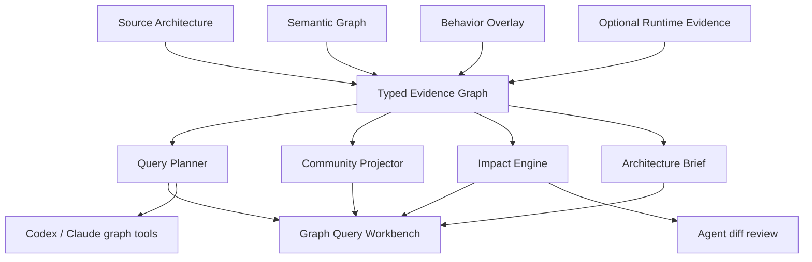

# Witch Graph Intelligence v1 명세

[한국어](graph-intelligence-v1.ko.md) · [English](graph-intelligence-v1.md)

상태: P0 완료, P1 일부 구현, P2 일부 구현
계약: `witch.graph-query/v1`, `witch.graph-community/v1`, `witch.graph-impact/v1`, `witch.architecture-brief/v1`, `witch.agent-graph-context/v1`, `witch.graph-impact-review/v1`, `witch.agent-experience/v1`, `witch.agent-experience-overlay/v1`, `witch.analysis-integrity/v1`, `witch.last-known-good/v1`, `witch.graph-meta/v1`, `witch.graph-federation/v1`
대상: Python, Rust, TypeScript/JavaScript 분석으로 생성된 `witch.architecture/v1` 및 선택적 semantic/behavior overlay

## 1. 목표

Witch의 검증된 typed directed evidence graph를 사람이 탐색하고 Agent가 제한된 컨텍스트로 사용할 수 있는 Graph Intelligence 계층으로 확장한다. Graphify에서 검증된 질의, 커뮤니티, 변경 영향, 리포트 개념을 참고하되 Witch의 근거·신뢰·방향성·다중 관계 계약을 유지한다.

Graph Intelligence는 원본 그래프를 수정하지 않는다. 모든 결과는 특정 `sourceRevision`에 결박된 파생 reading이며, 오래된 revision에는 적용할 수 없다.

## 2. 신뢰 경계

- `verified`: 소스, manifest, 언어 서버 또는 검증된 정적 분석에서 직접 확인된 사실
- `authored`: 사용자가 작성한 구조와 의도
- `inferred`: 규칙 또는 AI가 제안한 잠정 관계
- `observed`: 명시적으로 실행한 Task의 구조적 runtime trace
- `conflicting` 또는 `stale`: 자동 승인하지 않고 질문 및 검토 대상으로 남긴다.

커뮤니티, 중심성, 영향도, 제안 질문은 모두 `derived` reading이다. 이는 구조적 증거를 요약하지만 새로운 코드 사실을 만들지 않는다.

## 3. 논리 구조

## 4. 통합 evidence graph

원본 file/import graph, semantic graph, behavior graph를 하나의 읽기 전용 인덱스로 투영한다.

- 노드 ID와 관계 방향을 유지한다.
- 같은 두 노드 사이의 서로 다른 관계를 합치지 않는다.
- source, semantic, behavior 관계의 provenance와 confidence를 보존한다.
- evidence의 `path`, `line`, `hash`를 결과에 전달한다.
- 검증되지 않았거나 현재 source revision과 맞지 않는 overlay는 사용하지 않는다.

## 5. Graph Query 계약

입력:

- `query`: 사람 또는 Agent의 검색어
- `seedNodeIds`: 사용자가 선택했거나 감사 가능한 subsystem이 지정한 stable graph ID
- `depth`: seed에서 탐색할 최대 hop, 기본 2, 최대 6
- `tokenBudget`: 결과 컨텍스트의 근사 토큰 상한
- `direction`: `upstream`, `downstream`, `both`
- `trust`, `kinds`, `relationKinds`: 선택적 필터
- `maxSeeds`: 동점 폭발을 제한하는 seed 상한

출력:

- lexical score와 근거를 가진 seed 목록
- 예산 안에서 seed 우선으로 정렬된 노드와 typed relation
- 같은 label의 정확 일치 후보가 여러 개인 경우 ambiguity receipt
- 잘린 노드·관계 수와 truncation notice
- `sourceRevision`, 선택적 `semanticRevision`

질의기는 답을 생성하지 않는다. 검증 가능한 작은 evidence packet을 만들며, Codex 또는 Claude가 이를 해석한다.

## 6. Community 계약

v1은 외부 네이티브 의존성 없이 재현 가능한 단일 단계 modularity local-moving을 사용한다.

- 입력 순서와 무관하도록 ID를 canonical sort한다.
- directed multi-relation을 가중치가 있는 undirected projection으로만 변환한다.
- `calls`, `executes`, `precedes`, `branches-to`, `retries`는 강하게, `contains`는 약하게 반영한다.
- 커뮤니티 label은 우선순위가 높은 component/workflow/module hub에서 결정한다.
- 각 결과에 member signature, cohesion, 내부/외부 관계 수를 기록한다.
- 결과는 `derived`이며 authored System/Component 계층을 대체하지 않는다.

## 7. 변경 영향 계약

입력은 변경된 semantic node ID 또는 경로 목록이다. 관계 의미에 따라 전파 방향을 다르게 적용한다.

- `contains`, `defines`: 자식 변경을 부모 경계로 역전파
- `calls`, `imports`, `depends-on`, `reads`, `observes`: 피호출/의존 대상 변경을 소비자에게 역전파
- `precedes`, `branches-to`, `retries`, `routes-to`, `emits`: workflow의 뒤쪽 실행 경로로 순방향 전파

출력은 변경 seed, 영향 노드, 각 노드까지의 evidence path, 영향받는 component/workflow, 추천 테스트 경로와 bounded risk score를 포함한다.

## 8. Architecture Brief 계약

특정 source revision에서 다음을 결정적으로 계산한다.

- corpus/coverage 요약
- 커뮤니티와 대표 hub
- god node 후보
- 커뮤니티 bridge 후보
- typed directed cycle
- open/conflicting/stale 질문
- 분석 한계와 근거 부족 경고

LLM 설명은 이 deterministic brief 위에서만 선택적으로 작성하며 원본 수치를 바꾸지 않는다.

## 9. 실패 안전성

- graph와 semantic validation이 유효하지 않으면 intelligence reading을 생성하지 않는다.
- source revision이 다르면 overlay를 제외한다.
- 동일 입력은 동일한 정렬, community membership, receipt를 생성한다.
- 저장소 입력 순서를 바꿔도 Federation membership과 link가 안정적이다. 작성된 Mapping이나 Revision-bound 승인이 없으면 중복 Package Provider는 열린 질문으로 남고, 오래된 승인은 무시된다.
- UI는 결과가 잘렸음을 숨기지 않는다.
- 파일·node·symbol·relation·semantic node·workflow의 비율 및 절대 감소를 함께 판정한다. 작은 저장소나 일반적인 단일 파일 수정은 guard를 작동시키지 않는다.
- 사라진 source path가 실제 디스크에서도 모두 삭제된 경우 branch 전환 또는 대량 삭제로 설명되는 감소로 승인한다.
- 설명되지 않는 대량 감소 후보는 격리하고, 별도 위치에 원자적으로 저장된 last-known-good graph를 표시한다. 격리 후보는 snapshot과 증분 index를 덮어쓰지 않는다.
- last-known-good 저장소가 손상되거나 크기 상한을 넘으면 새 후보로 덮어쓰지 않고 분석을 fail-closed한다.
- 사용자는 캐시를 비우고 다시 분석하거나, 후보 revision을 명시적으로 새 baseline으로 승인할 수 있다. 명시적 승인은 `user-accepted` decision으로 남는다.
- 외부 저장소 텍스트는 Agent 지시가 아니라 untrusted evidence로 전달한다.

## 10. 단계별 구현

### P0

- 통합 evidence index
- bounded query, ambiguity, route/context receipt
- deterministic community projection
- typed reverse impact 분석
- deterministic architecture brief
- Constellation의 Graph Intelligence 패널

### P1

- **구현됨:** Codex/Claude 공통 `preflight-context` graph tool 계약. 현재 Provider 실행 전에 Witch가 동일한 bounded query와 brief를 계산해 전달한다.
- **구현됨:** 최종 Agent diff의 changed path를 graph node/symbol로 해석해 bounded impact receipt를 리뷰와 immutable Engineering Run `impact.analyzed` 이벤트에 첨부한다.
- **명시적 제한:** 현재 어댑터는 Provider-native 동적 tool calling이 아니다. `witch.graph.query`와 `witch.graph.brief`의 결과를 읽기 전용 사전 컨텍스트로 전달하고, `witch.graph.impact`는 변경 후 Witch가 직접 실행한다.
- **구현됨:** `useful`, `dead-end`, `corrected` Engineering Run experience receipt. 명시적 적용은 useful, 적용하지 않은 archive는 dead-end, 검증 실패 후 성공한 bounded repair는 corrected로 기록한다.
- **구현됨:** source hash 기반 experience freshness. 다음 Agent run은 모든 evidence hash가 현재 source와 일치하는 경험만 받으며 stale과 evidence 없는 unknown 경험은 ID와 제외 개수만 전달한다.
- **개인정보·신뢰 경계:** experience에는 모델 응답과 source 본문을 저장하지 않는다. bounded graph ID, 경로, 기대 hash, Witch가 생성한 결과 사유만 저장한다.
- **구현됨:** `witch.analysis-integrity/v1` unexplained-shrink guard. source graph의 대규모 감소를 절대값과 비율로 함께 감지하고 실제 파일 삭제 여부로 설명 가능성을 확인한다.
- **구현됨:** `witch.last-known-good/v1` persistent graph. 증분 cache와 분리해 원자적으로 저장하며 앱 재시작 후에도 검증·복원한다. 손상된 저장소는 보존하고 fail-closed한다. UI는 격리 경고, `Rebuild & retry`, 명시적 `Accept candidate`를 제공한다.

### P2

- **구현됨:** 검증된 `witch.knowledge/v1` overlay를 통한 ADR/RFC rationale, package/dependency, configuration 노드. [Architecture Knowledge v1 명세](architecture-knowledge-v1.ko.md)를 따른다.
- **구현됨:** `witch.graph-meta/v1` 다중 해상도 community meta graph. System에서 Community·Component·Workflow·Symbol로 drill-down하고 집계 relation의 원본 ID·종류·trust·evidence를 보존한다. [Multi-resolution Meta Graph v1 명세](multi-resolution-meta-graph-v1.ko.md)를 따른다.
- **Preview 구현됨:** 최근 프로젝트의 최신 검증 Reading을 연결하는 `witch.graph-federation/v1` 다중 저장소 Map. 저장소별 Revision 경계를 유지하고 같은 생태계의 정확한 Package Identity만 연결한다. 실제 선언과 대조된 `.witch/federation.json` Mapping은 Provider를 Source-authored로 확정한다. 그 외 중복 Provider는 명시적 승인이 정확한 Source Revision에 대해 Atomic Journal로 기록될 때까지 conflicting Grill-me 질문으로 남는다. UI는 보존된 결정을 보여주며 Audit History를 삭제하지 않고 범위가 결박된 Revocation을 추가한다. [다중 저장소 Federation v1 명세](multi-repository-federation-v1.ko.md)를 따른다.
- 완전한 benchmark fixture, raw receipt, UI comprehension 평가

## 11. 완료 기준

- 모든 계약에 source revision이 존재한다.
- 질의 결과가 token budget을 넘으면 seed를 보존하고 truncation을 기록한다.
- 동명 심볼은 임의 선택하지 않고 ambiguity로 남긴다.
- 영향도는 노드 목록뿐 아니라 전파 evidence path를 반환한다.
- 커뮤니티 결과는 입력 배열 순서를 바꿔도 동일하다.
- brief의 cycle, hub, question 수치가 테스트 fixture에서 재현된다.
- UI에서 결과 노드의 source를 열거나 Agent context로 첨부할 수 있다.
- 설명되지 않는 대규모 graph 감소는 마지막 정상 reading 및 index/snapshot을 덮어쓰지 않는다.
