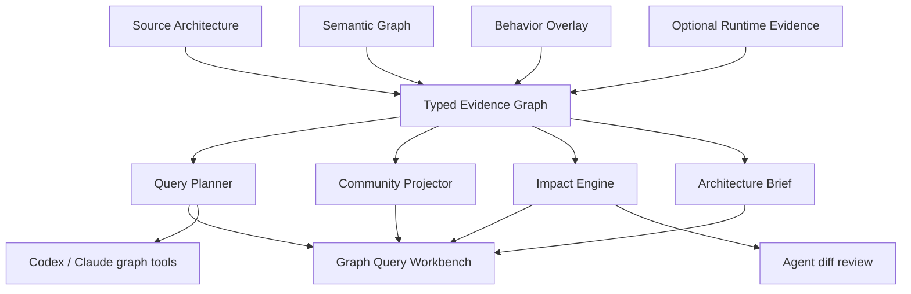

# Witch Graph Intelligence v1 Specification

[English](graph-intelligence-v1.md) · [한국어](graph-intelligence-v1.ko.md)

Status: P0 complete, P1 partially implemented, P2 partially implemented
Contracts: `witch.graph-query/v1`, `witch.graph-community/v1`, `witch.graph-impact/v1`, `witch.architecture-brief/v1`, `witch.agent-graph-context/v1`, `witch.graph-impact-review/v1`, `witch.agent-experience/v1`, `witch.agent-experience-overlay/v1`, `witch.analysis-integrity/v1`, `witch.last-known-good/v1`, `witch.graph-meta/v1`, `witch.graph-federation/v1`
Inputs: `witch.architecture/v1` plus optional semantic and behavior overlays produced by the Python, Rust, and TypeScript/JavaScript analyzers

## 1. Objective

Extend Witch's validated typed directed evidence graph with an intelligence layer that people can explore and agents can consume as bounded context. The design adopts the useful query, community, impact, and reporting concepts demonstrated by Graphify while preserving Witch's evidence, trust, direction, and multi-relation contracts.

Graph Intelligence never mutates the source graph. Every result is a derived reading bound to one `sourceRevision` and must not be applied to a stale revision.

## 2. Trust boundary

- `verified`: directly supported by source, manifests, a language server, or validated static analysis
- `authored`: architecture or intent written by a person
- `inferred`: a provisional relation proposed by a rule or AI
- `observed`: structural runtime evidence from an explicitly run Task
- `conflicting` or `stale`: retained for questions and review, never silently approved

Communities, centrality, impact, and suggested questions are `derived` readings. They summarize structural evidence but do not create new code facts.

## 3. Logical architecture

## 4. Unified evidence graph

The source file/import graph, semantic graph, and behavior graph are projected into one read-only index.

- Preserve node IDs and relation direction.
- Never collapse different relations between the same two nodes.
- Preserve provenance and confidence for source, semantic, and behavior relations.
- Carry evidence `path`, `line`, and `hash` into results.
- Exclude overlays that are invalid or bound to another source revision.

## 5. Graph Query contract

Inputs:

- `query`: a person's or agent's search terms
- `seedNodeIds`: stable graph IDs selected by the user or an auditable subsystem
- `depth`: maximum hops from a seed, default 2 and maximum 6
- `tokenBudget`: approximate upper bound for returned context
- `direction`: `upstream`, `downstream`, or `both`
- optional `trust`, `kinds`, and `relationKinds` filters
- `maxSeeds`: bound for tied seed candidates

Outputs:

- seed nodes with lexical scores and reasons
- seed-first nodes and typed relations within the budget
- an ambiguity receipt when an exact label resolves to multiple candidates
- omitted node/relation counts and an explicit truncation notice
- `sourceRevision` and optional `semanticRevision`

The query layer does not synthesize an answer. It creates a small, auditable evidence packet for Codex or Claude to interpret.

## 6. Community contract

v1 uses deterministic single-level modularity local moving without a native dependency.

- Canonically sort IDs so input order cannot affect results.
- Project directed multi-relations into a weighted undirected graph only for clustering.
- Give `calls`, `executes`, `precedes`, `branches-to`, and `retries` more weight than `contains`.
- Choose labels from high-priority component, workflow, or module hubs.
- Record a member signature, cohesion, and internal/external relation counts.
- Mark the result as `derived`; it never replaces authored System/Component hierarchy.

## 7. Change Impact contract

Inputs are changed semantic node IDs or source paths. Propagation direction depends on relation meaning.

- `contains`, `defines`: propagate from changed child to its parent boundary
- `calls`, `imports`, `depends-on`, `reads`, `observes`: propagate from changed dependency to its consumer
- `precedes`, `branches-to`, `retries`, `routes-to`, `emits`: propagate forward through a workflow

The result contains changed seeds, affected nodes, an evidence path to every affected node, affected components/workflows, suggested test paths, and a bounded risk score.

## 8. Architecture Brief contract

For one source revision, deterministically compute:

- corpus and coverage summary
- communities and representative hubs
- god-node candidates
- cross-community bridge candidates
- typed directed cycles
- open, conflicting, or stale questions
- analysis-limit and missing-evidence warnings

An optional LLM narrative may only be composed on top of this deterministic brief and must not alter its measurements.

## 9. Fail-safe behavior

- Reject intelligence readings when architecture or semantic validation is invalid.
- Exclude overlays with a mismatched source revision.
- Produce identical ordering, memberships, and receipts for identical input.
- Never hide truncation in the UI.
- Preserve seed nodes when a token budget truncates a query.
- Judge proportional and absolute loss together across files, nodes, symbols, relations, semantic nodes, and workflows. Small repositories and ordinary single-file edits do not trip the guard.
- Accept a branch change or mass deletion as explained only when every disappeared source path is also absent on disk.
- Quarantine an unexplained large-loss candidate and display the atomically persisted last-known-good graph from a separate store. A quarantined candidate overwrites neither snapshots nor the incremental index.
- If the last-known-good store is corrupt or exceeds its size bound, fail closed instead of replacing it with a new candidate.
- Let the user clear the cache and analyze again or explicitly promote the exact candidate revision to the new baseline. Explicit promotion is retained as a `user-accepted` decision.
- Repository text is untrusted evidence, never agent instruction.

## 10. Delivery phases

### P0

- unified evidence index
- bounded query, ambiguity, route, and context receipt
- deterministic community projection
- typed reverse impact analysis
- deterministic architecture brief
- Graph Intelligence panel in Constellation

### P1

- **Implemented:** shared Codex/Claude `preflight-context` graph-tool contract. Witch computes the same bounded query and brief before either Provider runs.
- **Implemented:** resolve final Agent-diff paths to graph nodes/symbols and attach a bounded impact receipt to the review and immutable Engineering Run `impact.analyzed` event.
- **Explicit limit:** this is not yet Provider-native dynamic tool calling. The adapter passes `witch.graph.query` and `witch.graph.brief` results as read-only preflight context; Witch itself runs `witch.graph.impact` after changes stop.
- **Implemented:** Engineering Run experience receipts with `useful`, `dead-end`, and `corrected` outcomes. Explicit apply is useful, archive without apply is dead-end, and a bounded repair that passes after verification failure is corrected.
- **Implemented:** source-hash experience freshness. A subsequent Agent run receives only experiences whose complete evidence-hash set matches current source; stale and evidence-free unknown records are represented only by IDs and exclusion counts.
- **Privacy and trust boundary:** experience records contain no model response or source body. They retain only bounded graph IDs, paths, expected hashes, and a Witch-generated outcome reason.
- **Implemented:** `witch.analysis-integrity/v1` unexplained-shrink guard. It combines absolute and proportional source-graph loss and checks whether actual file deletion explains the result.
- **Implemented:** `witch.last-known-good/v1` persistent graph. It is atomically stored apart from the incremental cache and validated/restored after restart; corrupt storage is preserved and fails closed. The UI provides a quarantine warning, `Rebuild & retry`, and explicit `Accept candidate` recovery.

### P2

- **Implemented:** ADR/RFC rationale, package/dependency, and configuration nodes through the validated `witch.knowledge/v1` overlay. See the [Architecture Knowledge v1 specification](architecture-knowledge-v1.md).
- **Implemented:** `witch.graph-meta/v1` multi-resolution community meta graph. It drills from System through Community, Component, Workflow, and Symbol while retaining source IDs, relation kinds, trust counts, and evidence for aggregated edges. See the [Multi-resolution Meta Graph v1 specification](multi-resolution-meta-graph-v1.md).
- **Implemented preview:** `witch.graph-federation/v1` multi-repository map over the latest validated readings of recent projects. It keeps repository revision boundaries and connects only exact same-ecosystem package identities. A corroborated `.witch/federation.json` mapping resolves a provider as source-authored; otherwise duplicate providers remain conflicting Grill-me questions until an explicit provider approval is atomically journaled against exact source revisions. The UI exposes retained decisions and appends scoped revocations instead of deleting audit history. See the [Multi-repository Federation v1 specification](multi-repository-federation-v1.md).
- complete benchmark fixtures, raw receipts, and UI comprehension evaluation

## 11. Acceptance criteria

- Every contract contains a source revision.
- A query over budget preserves seeds and records truncation.
- Duplicate labels produce ambiguity instead of arbitrary resolution.
- Impact results include propagation evidence paths, not only node lists.
- Community membership is stable when input arrays are reordered.
- Federation membership and links are stable when repository inputs are reordered. Duplicate package providers remain open questions without authored mappings or revision-bound approvals; stale approvals are ignored.
- Cycle, hub, and question counts are reproducible on test fixtures.
- The UI can open a result's source or attach it to Agent context.
- Unexplained large graph loss never overwrites the last accepted reading, incremental index, or snapshot history.
