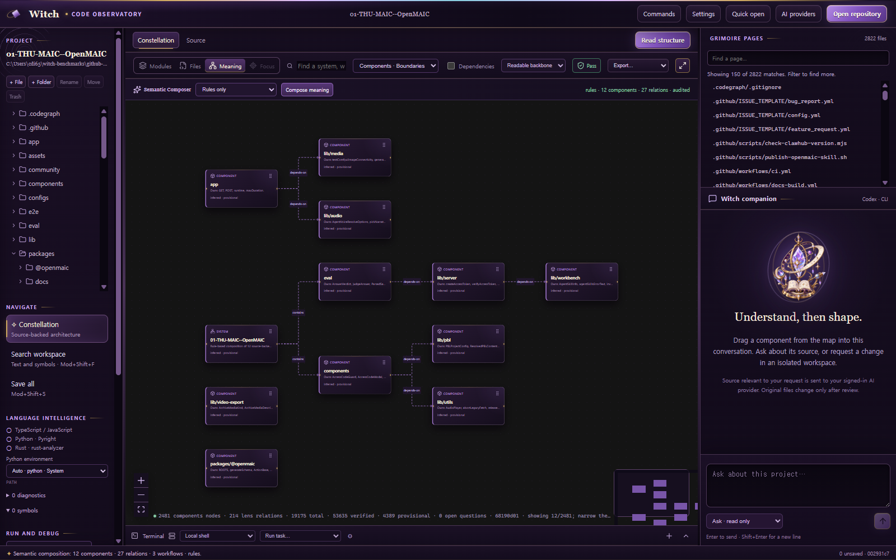
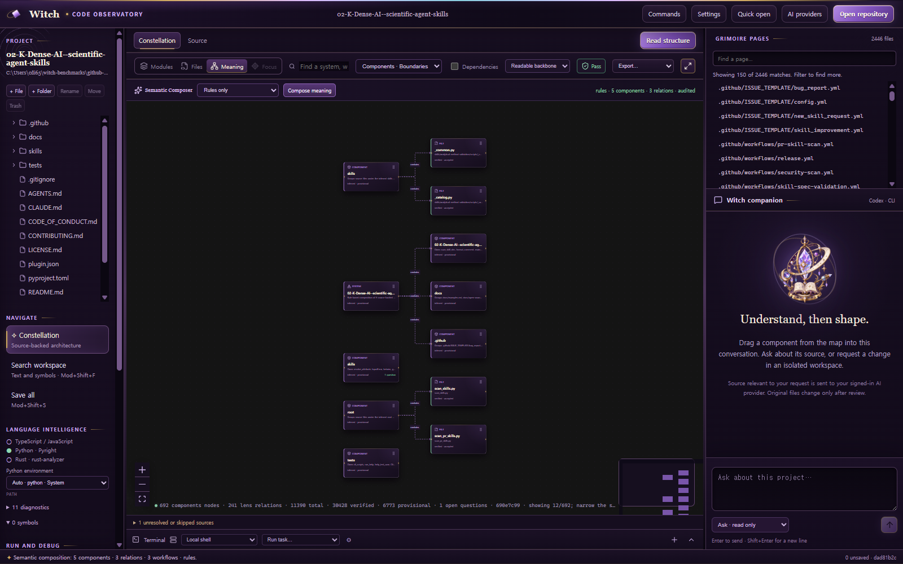
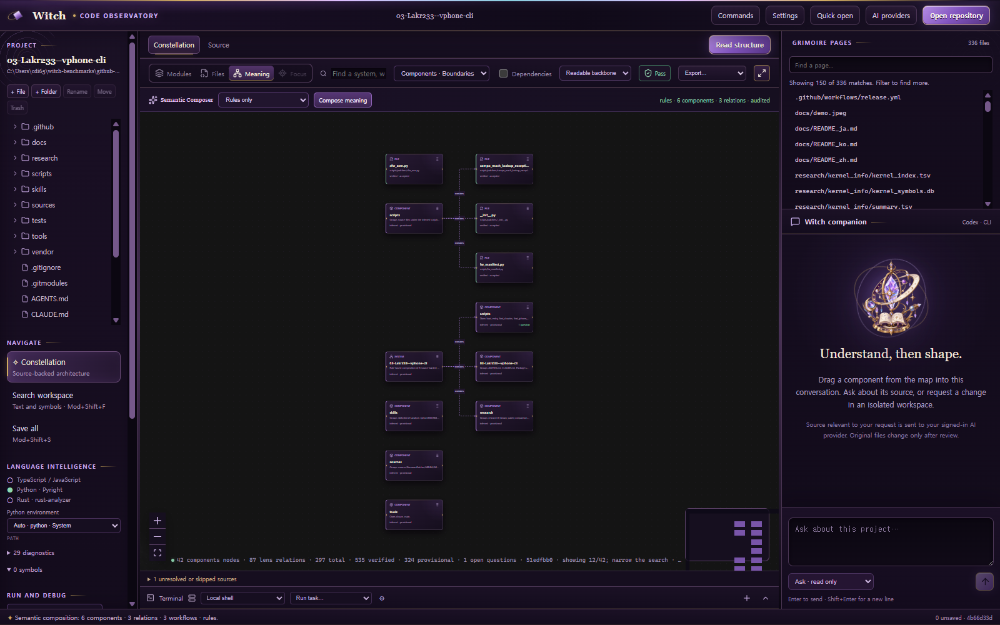
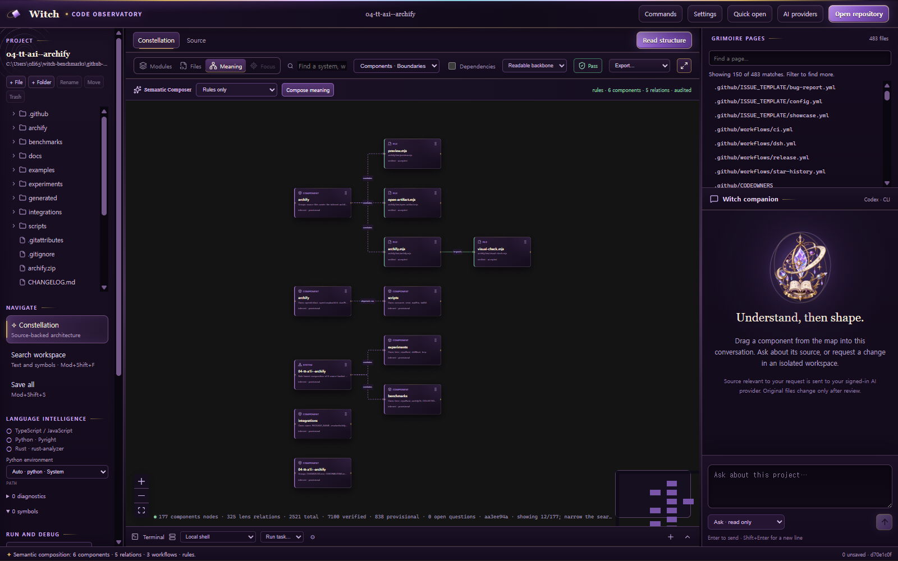
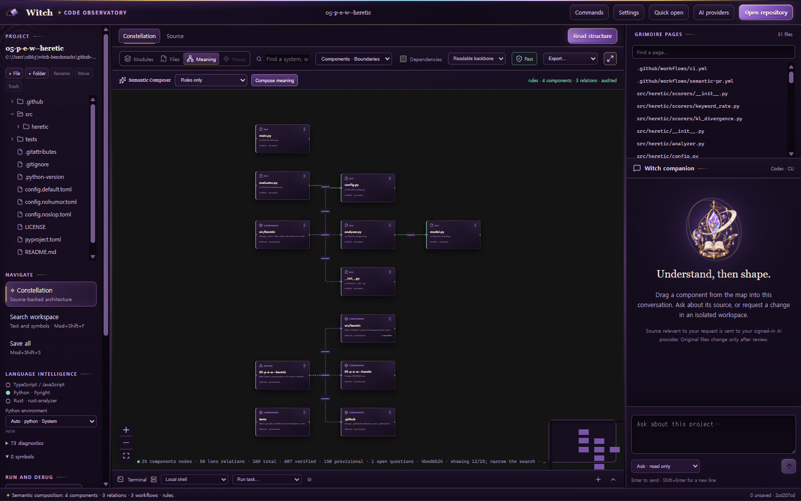
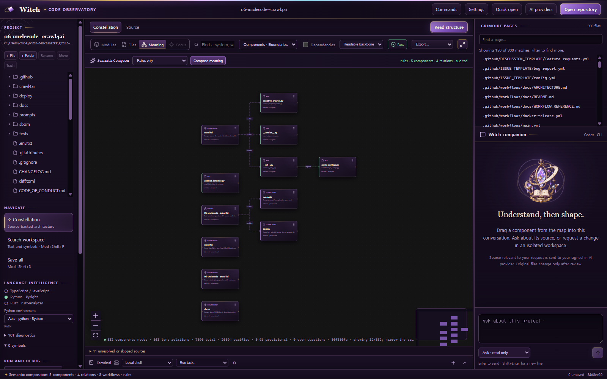
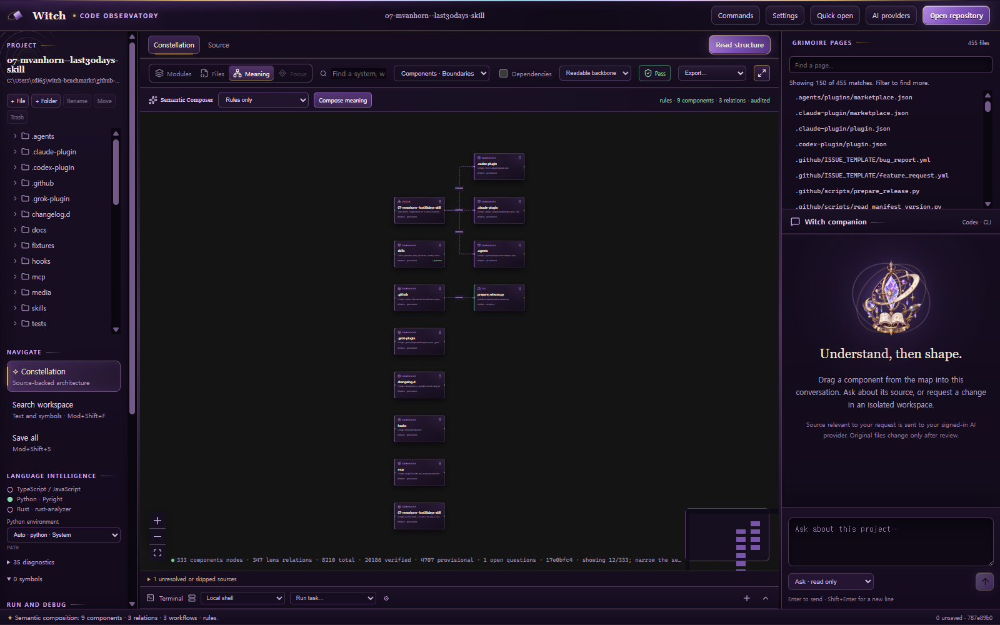
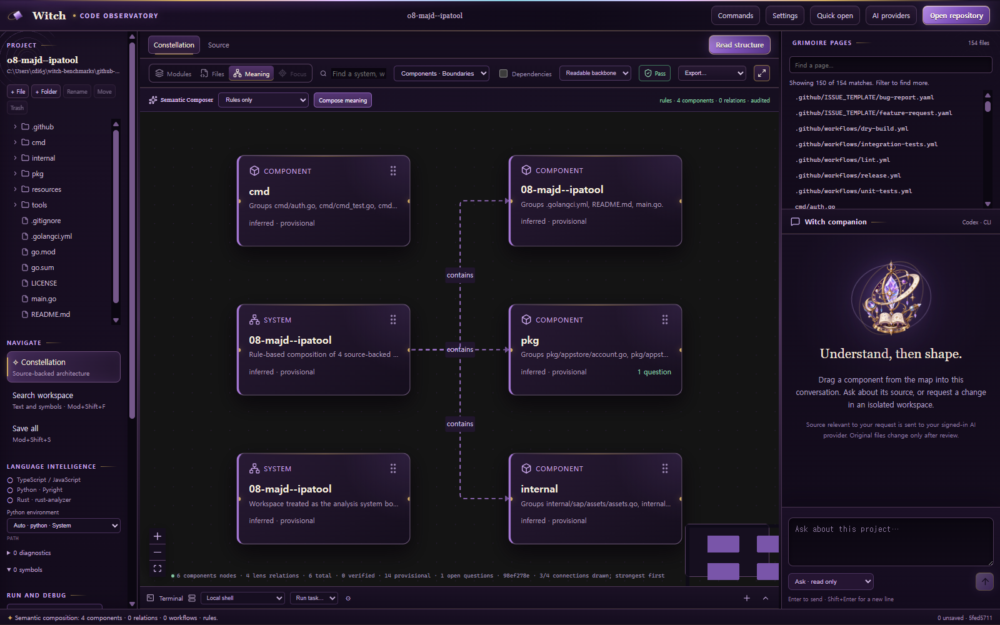
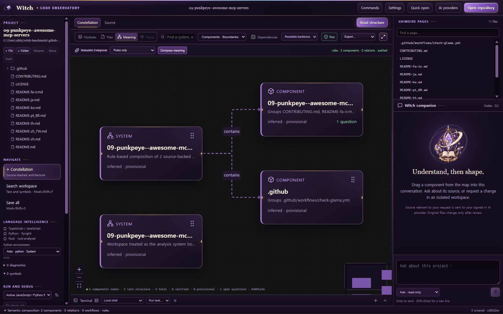
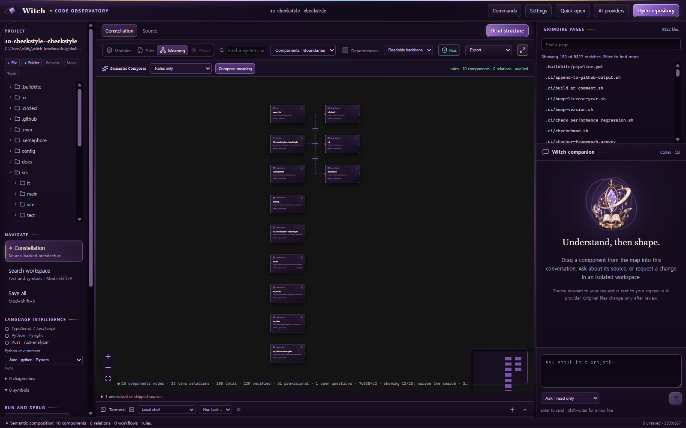

# Witch GitHub benchmark screenshots

Generated from the fixed 2026-08-31 benchmark checkouts. Repository code was not executed.

## 1. THU-MAIC/OpenMAIC

View: semantic-components

## 2. K-Dense-AI/scientific-agent-skills

View: semantic-components

## 3. Lakr233/vphone-cli

View: semantic-components

## 4. tt-a1i/archify

View: semantic-components

## 5. p-e-w/heretic

View: semantic-components

## 6. unclecode/crawl4ai

View: semantic-components

## 7. mvanhorn/last30days-skill

View: semantic-components

## 8. majd/ipatool

View: semantic-components

## 9. punkpeye/awesome-mcp-servers

View: semantic-components

## 10. checkstyle/checkstyle

View: semantic-components
